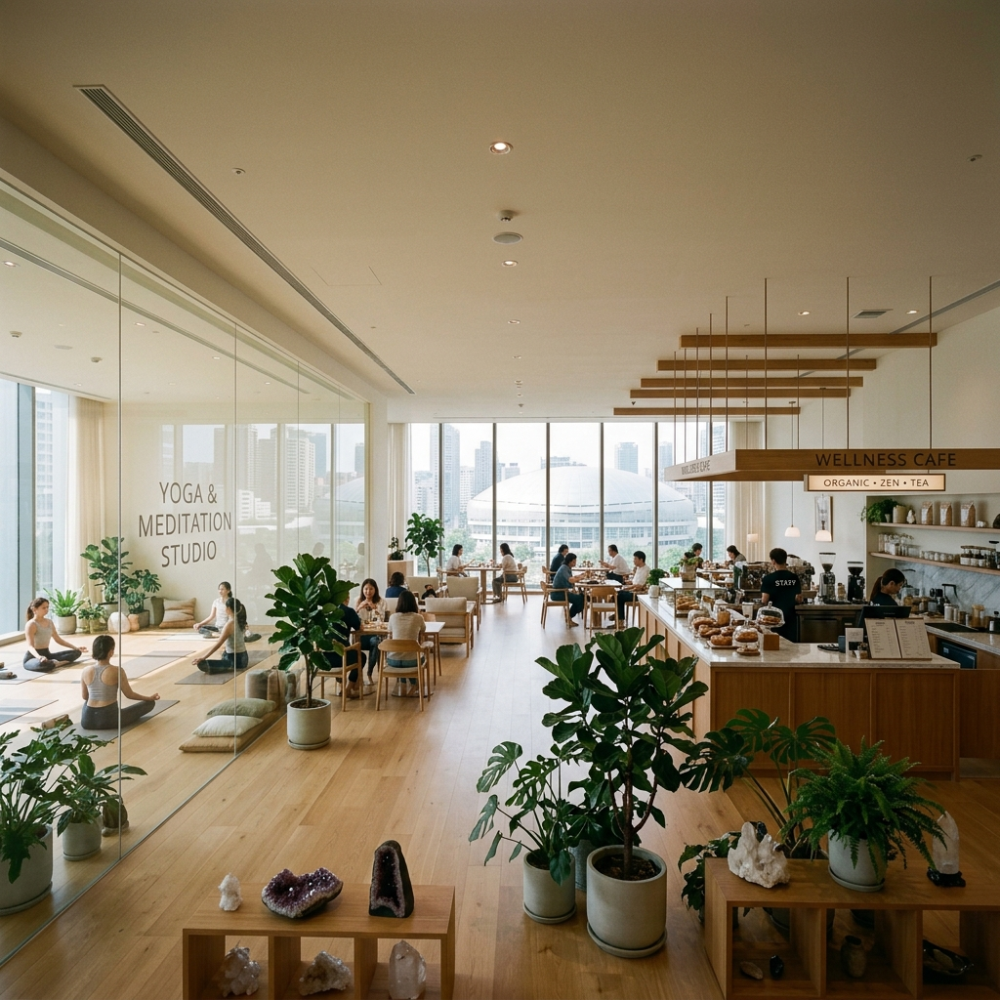
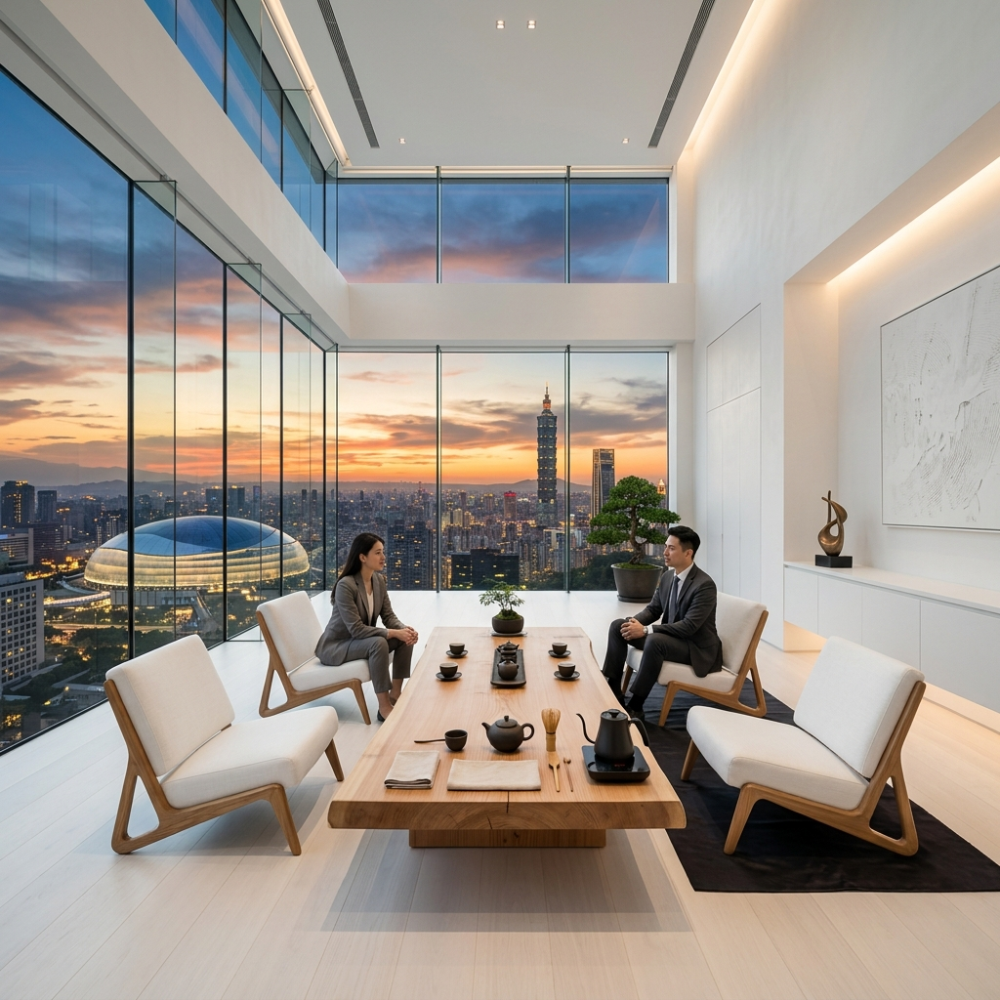
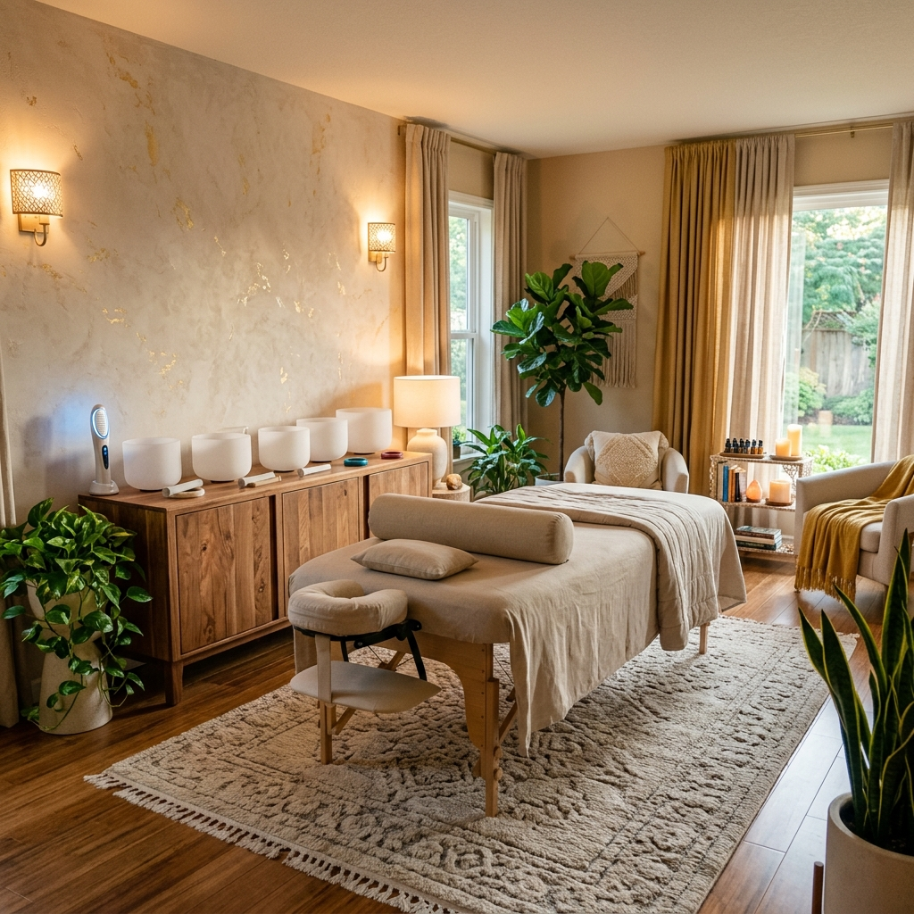

# 「真靈光」身心靈科技生態系 — 空間視覺設計提案

本提案旨在為「真靈光」旗艦基地打造具備身心靈能量、科技感與商業變現能力的頂級實體空間。空間視覺設計以高品質 3D 渲染圖呈現，並落實《真靈光黃金三年戰略企劃書》中對於空間配置、安全規範與業務功能之需求。

---

## 空間配置與設計理念

### 一、 1樓：真靈光身心靈複合式咖啡廳 (輕食能量區 & 動態修煉教室)
* **設計理念**：一樓為高頻日常流量容器，結合輕食、能量咖啡與美體引流（皮拉提斯、瑜珈）。整體空間採開闊的百坪設計，主調為純淨的白色與溫潤的淺色木質，擺設大量常綠植栽。
* **安全與空間特性**：
  * **玻璃隔間**：咖啡區與運動教室中間以通透的玻璃滑動拉門進行隔間，兼顧空間開闊感與靜音需求。
  * **單層安全天花板**：採用平整的單層室內天花板設計，無危險樓中樓或挑空設計，避免任何墜落風險。
  * **安全水晶擺設**：水晶裝飾穩固地平放於低矮陳列架與木桌上，不在牆面或吊頂進行危險懸掛。
  * **景觀對外窗**：大片落地玻璃窗引進自然採光，遠處可隱約眺望台北大巨蛋。
* **概念效果圖**：
  
* **AI 繪圖 Prompt**：
  ```text
  A wide-angle interior photograph of a premium, modern spiritual wellness cafe located on a single floor inside a building in Taipei. The entire space is extremely spacious and open (over 3000 square feet), with a standard flat ceiling (no lofts, mezzanines, or second floors, safe and flat). The color palette is dominated by clean white and warm light wood tones. To one side, separated by a clear, sleek glass wall, is a large, serene yoga and meditation studio. The main cafe area has elegant minimalist seating and a modern counter displaying healthy organic food, herbal teas, and coffee. Large floor-to-ceiling glass windows line the outer wall, letting in soft natural light, and offering a distant view of the Taipei Dome (domed stadium) in Taipei. Lush green indoor plants and natural crystal clusters are placed safely on low wooden tables and shelves (no crystals mounted on walls or hanging from the ceiling). The overall design feels premium, healing, zen, and open.
  ```

---

### 二、 2樓：總裁辦公室 — 頂級茶桌外交聖地
* **設計理念**：定位為「高端代理商與大客戶的成交聖地」。風格採極簡純白高維度大格局，展現總裁辦公室的尊榮與大氣。
* **核心配置**：
  * **十萬級實木茶桌**：中央擺設一張做工精緻、極具禪意的頂級實木茶桌與茶具，作為茶桌外交與簽約談判核心。
  * **無敵景觀**：整面全景玻璃落地窗，俯瞰台北市天際線，在夕陽餘暉中遠眺台北大巨蛋與台北 101。
* **概念效果圖**：
  
* **AI 繪圖 Prompt**：
  ```text
  Ultra-luxury executive office room, high-altitude view in Taipei. Minimalist pure white design, high ceilings, architectural digest interior. One wall is entirely a panoramic glass floor-to-ceiling window overlooking the Taipei city skyline and Taipei Dome under warm sunset glow. At the center is a premium zen solid-wood tea table with a minimalist tea set, high-end design, elegant modern low-profile chairs. Serene, high-vibe, powerful, corporate but spiritual --ar 16:9
  ```

---

### 三、 2樓：靈性療癒與量子調理室
* **設計理念**：提供頂級 VIP 個案調頻、情緒諮商與能量補充之私密空間。色調採用溫馨放鬆的米色與淡金色，搭配溫暖的局部照明，營造神聖且極度療癒的氛圍。
* **核心配置**：
  * **專業調理床**：中央配置專業級調理/按摩床，供進行經絡整復或能量調度。
  * **法器與儀器陳列**：木質置物櫃上整齊陳列專利的鈦缽（能量缽）、晶圓晶片（能量補充卡）以及專用量子能量檢測調理棒（E棒）。
* **概念效果圖**：
  
* **AI 繪圖 Prompt**：
  ```text
  High-end holistic spiritual healing therapy room. Luxurious, serene, warm ambient lighting. A minimalist massage/healing table in the center. On a side wooden cabinet, beautifully arranged polished crystal singing bowls, a modern specialized electronic energy wand device, and patterned semiconductor-like crystal wafers. Indoor green plants, soft drapery, warm beige and soft gold color scheme. Relaxing, modern spiritual clinic --ar 16:9
  ```
