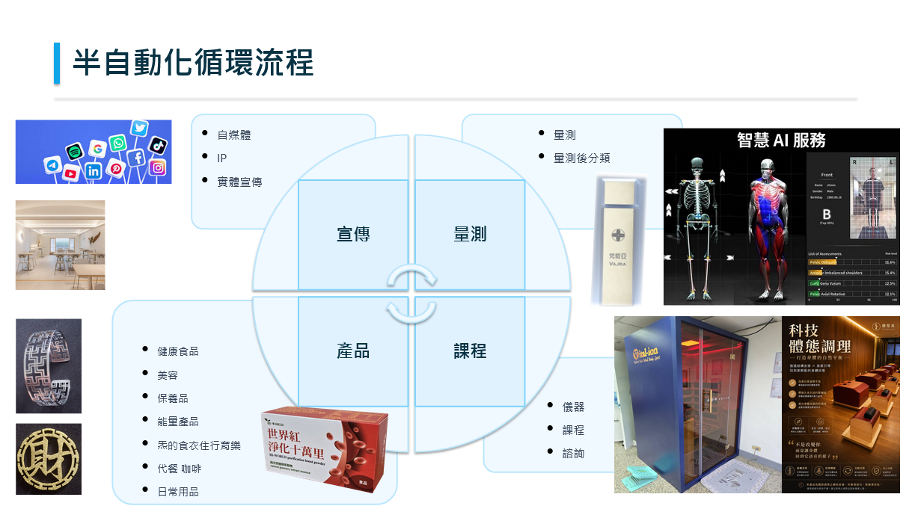
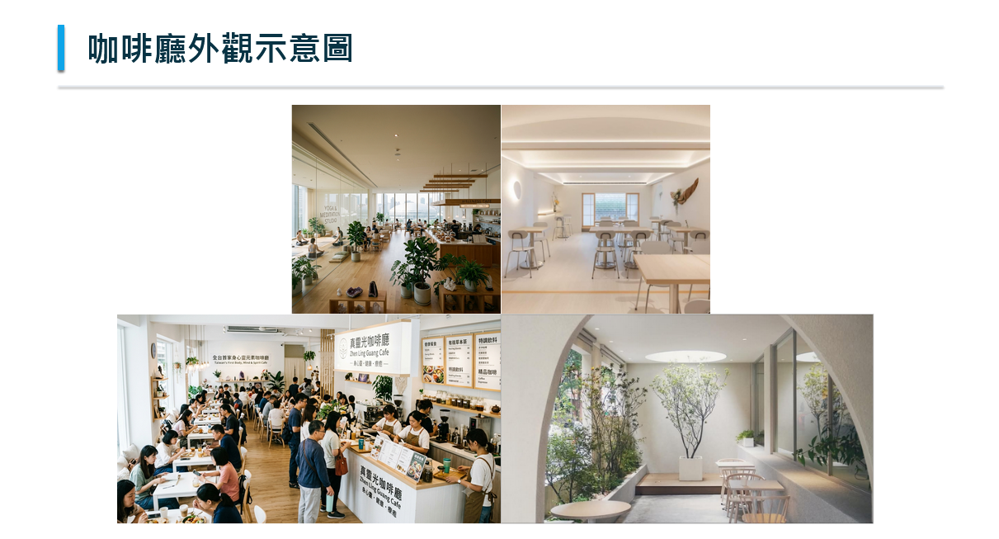
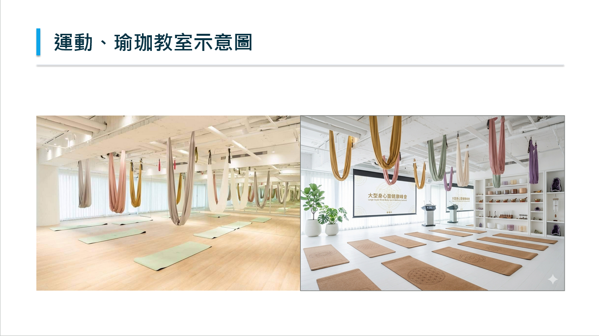
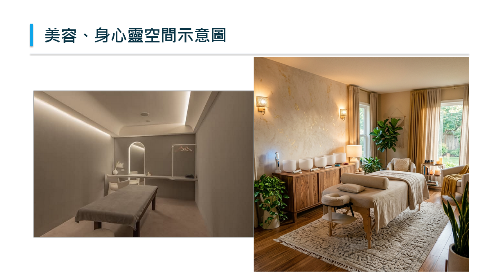
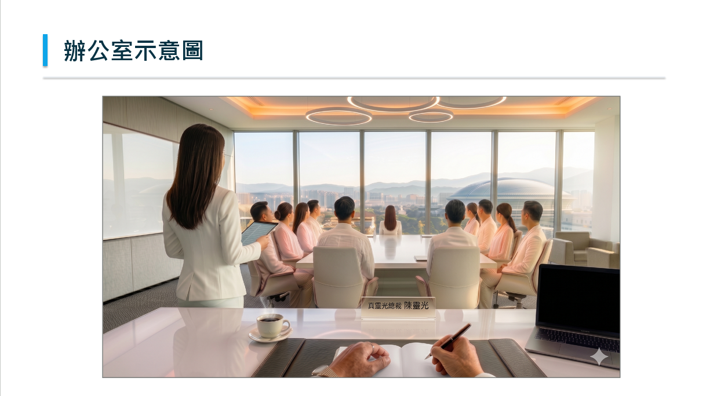
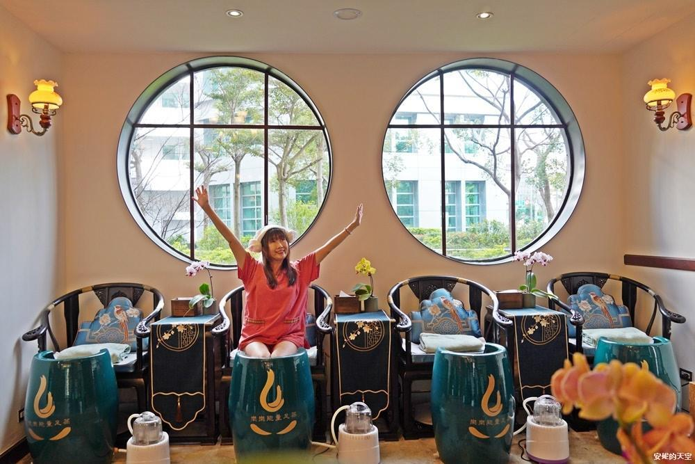
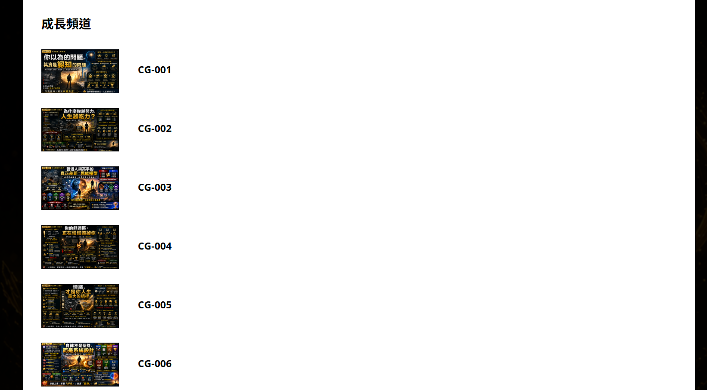
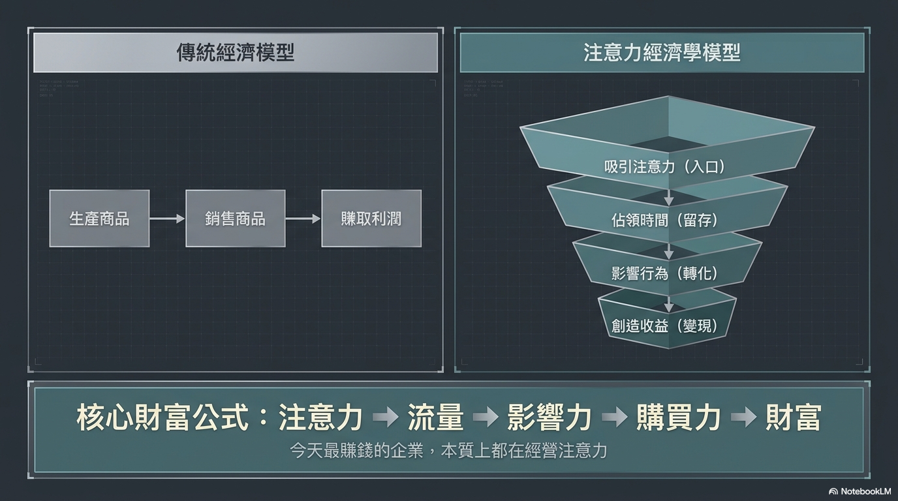
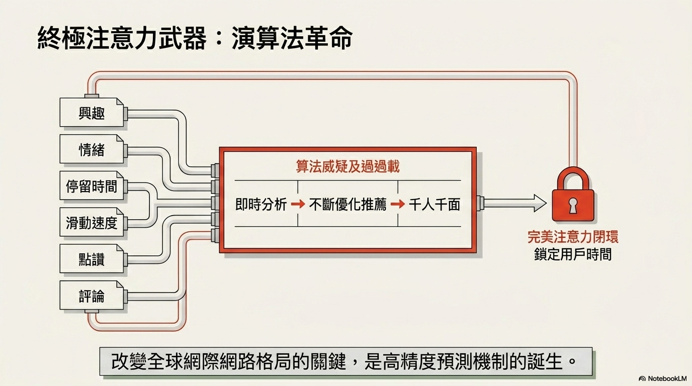

# 🌌 「真靈光」全球身心靈科技生態系 — 黃金三年戰略企劃書

> **呈報：陳老師**
>
> **提案人：陳仲豪（操盤手）**
>
> **核心理念：聚焦專長、分工明確、建立系統**

## 📋 目錄

> **•** \[一、願景與核心定位\]
>
> **•** \[二、操盤手資歷\]
>
> **•** \[三、黃金三年最高戰略目標\]
>
> **•** \[四、徹底根除過去六大亂象\]
>
> **•** \[五、三大系統權責分工\]
>
> **•** \[六、兩層樓變現漏斗（獲利閉環模型）
>
> **•** \[七、四大財務分潤引擎\]
>
> **•** \[八、雙公司防火牆機制\]
>
> **•** \[九、練習生海選與菁英孵化制度\]
>
> **•** \[十、第一年季度執行甘特圖\]
>
> **•** \[十一、第一年預算精算總表\]
>
> **•** \[十二、三年獲利與擴張時程\]
>
> **•** \[十三、企業成長路徑藍圖\]
>
> **•** \[十四、財政最高防禦機制\]
>
> **•** \[十五、向陳老師的三個問題Q&A\]

\
-

## 一、願景與核心定位

### 核心定位：

**身心靈一站式服務平台** —

身心靈界的嚴選蝦皮(線上平台)、

身心靈界的全聯(加盟店)/SOGO(旗艦店)。

### 經營目的：

幫助更多人**身心健康與靈性提升**，同時幫助身心靈從業者安身立命。

### 服務內涵：

### 

### 涵蓋診所、運動教室、咖啡廳、AI 量測區、諮詢室、整脊室，提供身心靈一站式服務。

### 服務流程：定 → 清 → 補

|  |  |  |  |  |
|----|----|----|----|----|
|  | **身** | **心** | **靈** | **財富** |
| **檢測** | AI 量子身心靈量測儀 |  | 線上照片出報告 |  |
| **定** | 整脊、經絡整復、按摩 | 諮詢、算命 | 諮詢 | 諮詢、行銷業務課程 |
| **清** | 能量艙、甕蒸、運動課程 | 鈦缽、心靈課程 | 鈦缽、音療課程、法會 | 行銷業務課程 |
| **補** | 營養補充、葉醫師產品、能量咖啡 草本茶 | 心靈課程、學員社群 | 量子能量補充卡（晶圓鍊）、能量水 衣服 | 行銷業務課程 |

### 陳老師的立場與目標

> **• 定位**：萬王之王，處理無形
>
> **• 目標**：拯救靈魂、一年機會培養、傳承徒弟靈性能力
>
> **• 三年目標**：三年功成身退，帶師母自由自在雲遊四海

\
-

## 二、操盤手資歷

**陳仲豪** — 全案操盤手

> **•** 學習身心健康 **30 年**
>
> **•** 身心靈健康產業 **21 年**經驗
>
> **•** 身心靈相關投入超過 **NT\$ 500 萬**
>
> **•** 台灣六萬名經銷商推薦 **第一名**
>
> **•** 拿過三家身心健康產業 **第一名**
>
> **•** 拿過 **20 個以上** 銷售冠軍
>
> **•** 經營過 **14 家** 身心健康相關實體店
>
> **•** 學員超過 **10,000人**

\
-

## 三、黃金三年最高戰略目標

### 六大最高目標

|  |  |  |
|----|----|----|
| **編號** | **戰略目標** | **說明** |
| ① | **明星老師與核心決策團隊完全就位** | 嚴選並培育最具感恩心性、鋼鐵紀律的核心明星導師及專業決策團隊 |
| ② | **建立三大系統核心齒輪** | 全面建立【靈性標準系統】、【行銷自媒體系統】與【運營客服系統】，形成自動化流程 |
| ③ | **陳老師三年內功成身退圓滿交棒** | 黃金三年內完成核心系統與文化交棒，移交核心決策團 |
| ④ | **實現平台全自動化去中心化運營** | 透過天網 APP、AI 量測出報告與儀器，標準化轉介分流，擺脫對單一大師的依賴 |
| ⑤ | **真正大面積提升身心靈健康與靈性提升** | 用科學大健康及真實調理破除怪力亂神偏見、真正全方位幫助海量人群 |
| ⑥ | **圓滿顯化全台 22 家連鎖據點** | 以連鎖加盟深耕台灣五大縣市與全球 |

### 三年階段總覽

<table>
<colgroup>
<col style="width: 14%" />
<col style="width: 49%" />
<col style="width: 36%" />
</colgroup>
<tbody>
<tr>
<td><strong>年度</strong></td>
<td><strong>主題</strong></td>
<td><strong>核心任務</strong></td>
</tr>
<tr>
<td><strong><mark>第一年</mark></strong></td>
<td><strong><mark>培訓 · 練兵練功 建構系統</mark></strong></td>
<td>
<strong><mark>培養身心靈老師偶像團體</mark></strong>，

建立三大系統，試營運旗艦店
</td>
</tr>
<tr>
<td><strong><mark>第二年</mark></strong></td>
<td><mark>培訓 + 產品 · 賺錢</mark></td>
<td><mark>大量招募代理商，開說明會，連鎖加盟啟動</mark></td>
</tr>
<tr>
<td><strong><mark>第三年</mark></strong></td>
<td><mark>培訓 + 產品 + 大量開店</mark></td>
<td><mark>全台 22 家店全面展開，陳老師圓滿交棒</mark></td>
</tr>
</tbody>
</table>

## 四、徹底根除過去六大亂象

> 針對過去亂象解決方案
>
> 簡單來說,就是讓招募的新人看到幾個重點
>
> 一.我們有行銷結果與行銷方法
>
> 二.我們有內部靈性標準系統
>
> 三.我們有規模的場地與給薪資
>
> 四.我們提供個案與示範影片
>
> 五.我們有一群好的內部團隊與文化
>
> 六.我們有套制度可以讓決策團隊可以一起分紅 大家一起努力

<table>
<colgroup>
<col style="width: 27%" />
<col style="width: 72%" />
</colgroup>
<tbody>
<tr>
<td><strong>亂象</strong></td>
<td><strong>解決方案</strong></td>
</tr>
<tr>
<td><strong>1. 內部抱怨以及攻擊與無中生有</strong></td>
<td>
建立靈性課程系統：

核心靈性課程 100%由 決策團隊親自操刀主導，

統一「感恩、真、善、愛」共同文化，並聚焦於感恩，他人優點，
與嚴格篩選制度。

真為真誠與只講真實存在有根據的話語、

善是善意與為他人著想

愛是感恩與肯定他人優點與付出

固定開會,建立彼此信任

很多話可以直接說的環境,有話直接跟本人溝通

並且建立一套制度是核心決策團隊一起分紅的制度.讓彼此幫助彼此

都是共同創辦人,一起分享利潤,就不必彼此爭奪
</td>
</tr>
<tr>
<td><strong>2. 團隊能力不足</strong></td>
<td>
大量海選有正確態度、感恩、優質能力的人，1000 個選 100 個即可

解決老師基本生存問題與建立好文化與作好的制度，越有產能收入越高，會簽合約

抱怨、負面、影響公司法律與名聲者，一律開除
</td>
</tr>
<tr>
<td><strong>3. 覺得沒看到行銷結果</strong></td>
<td>
行銷火力聚焦，全力捧紅「中醫師團隊、嚴美瑜、紫昀、仲豪」四大明星

並且把咖啡廳與運動教室用滿，產品銷售好之後看到行銷成果
</td>
</tr>
<tr>
<td><strong>４. 沒有個案練習、缺乏實戰</strong></td>
<td>
一樓高頻日常剛需顧客與代理商爆滿；總部實施「消費滿額免費尊榮送諮詢」，個案源源不絕分流給實習生，讓實習生有大量個案。

並且初期會錄製100個個案 ，讓大家可以學習．
</td>
</tr>
<tr>
<td><strong>5. 沒有行政與助理與沒錢</strong></td>
<td>有足夠資金並請助理並請總經理規劃內部標準流程</td>
</tr>
<tr>
<td><strong>6. 嚴重影響創辦人（陳老師）時間</strong></td>
<td>
許多事情跟當事人溝通，不要傳話，透過會議時解決

總經理包攬一樓咖啡店長營運、二樓診所日常行政；芊邑、紫昀制定技術
SOP，完全自動化培訓

陳老師只要做個案示範教學與協助看人與決策開會即可
</td>
</tr>
</tbody>
</table>

## 伍、三大系統權責分工

> 三大獨立齒輪互不干涉、權責嚴密嚙合。

### 1. 🏢 內部運營系統 — 總經理（紅塵鐵血大管家）

|  |  |
|----|----|
| **職責範疇** | **具體內容** |
| 內部營運流程 | 制定旗艦基地兩層樓日常行政流程、標準出勤、核心宿舍自律規範及日常考核 |
| 咖啡廳與店長管理 | 一層「輕食能量咖啡廳」的店長招聘、人事考核、物料收銷存盤點與櫃台收銀 |
| 運動教室行政 | 一層「動態修煉教室」的行政與老師排班、場地營運與器材維護 |
| 客戶服務系統 | 建立一條龍客戶服務與反饋流程，確保高頻消費顧客的服務滿意度 |
| 診所常規管理 | 統籌二樓中醫診所的醫事合規行政、醫護人員排班、自費項目行政盤點 |
| 面試 | 面試一般員工,如店長 櫃台等 |

### 2. 🎬 行銷業務系統 — 陳仲豪（操盤手）＆ 自媒體拍片團隊

<table>
<colgroup>
<col style="width: 16%" />
<col style="width: 83%" />
</colgroup>
<tbody>
<tr>
<td><strong>職責範疇</strong></td>
<td><strong>具體內容</strong></td>
</tr>
<tr>
<td>自媒體流量矩陣</td>
<td>帶領剪輯、企劃、美編、工程師團隊，每日內容會議，掌控短影音引流池</td>
</tr>
<tr>
<td>四大 IP 火力捧紅</td>
<td>針對「診所醫師團隊、嚴美瑜、紫昀、陳仲豪」四大核心 IP
全面短影音包裝</td>
</tr>
<tr>
<td>研發變現課程</td>
<td>研發行銷與業務實戰線上影音課程，驅動全台代理商裂變</td>
</tr>
<tr>
<td>紀實節目跟拍</td>
<td>全程跟拍練習生特訓、面試篩選、考核與蛻變過程，做成高黏著自媒體紀實節目</td>
</tr>
<tr>
<td>網頁技術控管</td>
<td>主導身心靈的平台，主要是透過免費的靈性課程引導人來不斷學習，學習之後再透過網站慢慢引導到諮詢、課程與產品、名單與資訊流的控管</td>
</tr>
<tr>
<td>製作節目</td>
<td>
台灣好產品：,安排專業人士IP上去評選好產品 增加曝光量
也剛好可以選產品,也可以透過這個節目來增加曝光,

專家訪談節目：　訪談我們的專家ＩＰ，建立流量
</td>
</tr>
</tbody>
</table>

### **3. 🔮 靈性培訓系統 — 12位靈性培訓系統決策團隊**

真靈光靈性培訓系統由 12 位核心決策團隊組成（包含靈性培訓總監、副總監及
10
位具備專屬靈性專長的導師），負責海選後練習生之系統化培訓、日常考核升等，並擁有集團最高決策權與
Tier 1
虛擬股分紅權。團隊依職能劃分為「系統統籌」、「培訓執行」、「靈性醫檢師」、「靈性外科醫師」、「靈性長照」與「靈性護理師」六大專業分工，打造標準化、系統化的心靈療癒與培訓體系。

|  |  |  |  |
|:--:|:--:|:--:|:--:|
| **職稱** | **靈性定位類別** | **核心靈力專長與職能** | **負責之靈性培訓工作內容** |
| 靈性培訓總監 | 🔮 系統統籌 | 整體師資考核、課程標準制定、培訓體系運營 | 統籌所有靈性老師培訓標準、考核升等機制與核心教材編撰 |
| 靈性培訓副總監 | 🔮 培訓執行 | 日常培訓班務管理、培訓執行與師資行政協調 | 負責培訓班程排課、師資行政支援、第一線培訓成效評估與回報 |
| 首席靈魂本質診斷師 | 🔬 靈性醫檢師 | 具備超強的靈性直覺，一眼看出學員的性格本質與當面臨的心靈核心卡點。 | 負責引導新人入學，為學員進行初步的心靈體檢與選課方向建議。 |
| 靈識光譜分析師 | 🔬 靈性醫檢師 | 擅長分析學員的情緒脈絡與氣場強弱，像精準的心靈健康分析儀器。 | 協助學員釐清內在盲點，規劃個人專屬的心靈成長與靜心方案。 |
| 首席靈能手術師 | 🔪 靈性外科醫師 | 擅長深入清理學員深埋心底的創傷記憶，協助釋放壓抑已久的痛苦情緒。 | 負責帶領深層釋放與創傷療癒的高階心靈療癒工作坊。 |
| 業力負能切除師 | 🔪 靈性外科醫師 | 能有效協助學員切斷過去不健康的人際關係、負面環境的能量糾纏。 | 輔導因情感、人際或家庭衝突而陷入嚴重情緒內耗的學員。 |
| 靈魂安撫導師 | 🛋️ 靈性長照 | 擁有極佳的同理心與療癒嗓音，能快速讓焦慮、恐慌的學員感到平靜。 | 負責學員日常情緒急救諮詢與一對一的深度心靈撫慰關懷。 |
| 心靈光愛陪伴師 | 🛋️ 靈性長照 | 提供長期、溫暖且無條件的傾聽與陪伴，像心靈長照般讓人感到安心。 | 負責學員的長期售後關懷與陪伴小組，建立學員的安全感與信任。 |
| 靈魂渡化導師 | 🛋️ 靈性長照 | 引導學員釋懷對過去失敗、親人離去或遺憾的執念，學會真正放下。 | 提供面對失落、悲傷輔導的團體引導，協助學員重新看見生活希望。 |
| 脈輪氣場調理師 | 🩹 靈性護理師 | 運用聲音、香氛與光譜等自然方式，調理學員疲憊的身體與氣場平衡。 | 在實體店面為學員提供身心舒壓調理與放鬆課程。 |
| 聲頻能量護理師 | 🩹 靈性護理師 | 精通頌缽、音叉等聲波療癒工具，幫助學員釋放身體壓力、改善睡眠。 | 負責舒壓放鬆、助眠頌缽課程的規劃與日常教學。 |
| 心靈光華調養師 | 🩹 靈性護理師 | 結合日常健康生活作息與心理引導，像護理師一樣照顧學員的身心平衡。 | 規劃學員的課後日常身心保養計畫，協助將放鬆融入日常生活。 |

## **六、核心決策團隊 24 人與全員多層級分紅激勵制度**

為建立全體夥伴的利益共同體，真靈光集團設立了『黃金分紅存摺分紅制度』。我們不搞複雜的虛擬名稱，公司每年會從稅後淨利提撥固定比例
(15%～22%)
作為『全體稅後分紅池』發放給大家當作年終分紅。這筆分紅池專門配發給核心決策團隊
(共 24
人)。分紅資格必須在公司服務滿第一年才解鎖，以防範短期投機行為。如成員違反集團誠信理念或禁忌高壓電線，未生效的分紅比例全數沒收，已發發之分紅法務有權追回。

<table style="width:100%;">
<colgroup>
<col style="width: 20%" />
<col style="width: 20%" />
<col style="width: 20%" />
<col style="width: 20%" />
<col style="width: 20%" />
</colgroup>
<tbody>
<tr>
<td style="text-align: center;"><strong>分紅層級</strong></td>
<td style="text-align: center;"><strong>主要激勵對象</strong></td>
<td style="text-align: center;"><strong>基金分配比例</strong></td>
<td
style="text-align: center;"><strong>佔稅後淨利比(營收達標)</strong></td>
<td style="text-align: center;"><strong>激勵分配機制說明</strong></td>
</tr>
<tr>
<td style="text-align: center;">🥇 第一層：核心決策團隊</td>
<td
style="text-align: left;">24位決策成員（總監/副總監/10位導師等）</td>
<td style="text-align: center;">40%</td>
<td style="text-align: center;">9.6% ~ 12.0%</td>
<td style="text-align: left;">核心決策團隊 (24人)
共同瓜分，分紅佔比微調下調為 40%
以優化代理商地推動力。個人分紅比例為： 
• 總監級 (2人)：各享 5.50% 核心池份額 
• 經理級 (12人)：各享 3.66% 核心池份額 
• 導師級 (10人)：各享 2.20% 核心池份額</td>
</tr>
<tr>
<td style="text-align: center;">🥈 第二層：高階與專業人士</td>
<td style="text-align: left;">部門副理/內聘醫師/運動教練/產品主管</td>
<td style="text-align: center;">25%</td>
<td style="text-align: center;">6% ~ 7.5%</td>
<td style="text-align: center;">高階經理與專業人士（共 20
人）每人固定分得第二層分紅池的 5% 份額，享有中高階利潤分紅。</td>
</tr>
<tr>
<td style="text-align: center;">🥉 第三層：基層一般員工</td>
<td style="text-align: left;">櫃台服務人員/客服/小編/攝影/護理師等</td>
<td style="text-align: center;">5%</td>
<td style="text-align: center;">1.2% ~ 1.5%</td>
<td
style="text-align: left;">年度考核及格即可分紅，分紅額度依在職年資享有倍數加成： 
• 在職第 1 年：1.0 倍基礎分紅份額 
• 在職第 2 年：1.2 倍分紅份額 
• 在職第 3 年：1.5 倍分紅份額 
• 在職第 4 年以上：2.0 倍分紅份額/年 
（※ 白話意思：只要員工表現及格即可分紅，待得越久拿得越多。第一年的人拿 1
份，第二年拿 1.2 份，第三年拿 1.5 份，第四年拿雙倍。）</td>
</tr>
<tr>
<td style="text-align: center;">🏅 第四層：代理商超額激勵</td>
<td style="text-align: left;">個人+第一代月銷達門檻之「LV4
靈光經銷商」</td>
<td style="text-align: center;">—</td>
<td style="text-align: center;">集團總營業額 2%</td>
<td style="text-align: left;">專為達到「LV4
靈光經銷商」業績門檻之頂尖推廣領袖設立，提撥集團總營業額之 2%
作為加盟開店基金。</td>
</tr>
</tbody>
</table>

### 為建立全體夥伴的利益共同體，真靈光集團設立了『黃金分紅存摺制度』。公司每年會從稅後淨利提撥固定比例 (15%～22%) 作為『全體稅後分紅池』發放。這筆分紅池專門配發給核心決策團隊 (共 24 人)，按個人分紅比例直接發放。※特別聲明：本分紅比例純屬「年度稅後利潤分配權」，在法律上不持有公司任何實體股權、無表決權、無決策權，且離職自動取消，以百分之百確保集團經營控制權與實體股權不被稀釋。\
分紅資格必須在公司服務滿第一年才解鎖，以防範短期投機行為。如成員違反集團誠信理念或禁忌高壓電線，未生效的分紅資格全數沒收，已發放之分紅法務有權追回。

|  |  |  |
|:--:|:--:|:--:|
| **合夥條款** | **約束內容** | **真靈光落地運作規則** |
| 服務未滿一年限制 | 新授予的分紅資格必須服務滿第一年才開始解鎖生效。 | 若未滿第一年即離職，分紅資格自動取消，以防止短期投機。 |
| 違規沒收與回撥機制 | 若成員違反集團六大禁忌高壓電線或涉及法律糾紛。 | 未生效之分紅資格全數沒收，已發放分紅法務有權依法追回。 |

### **二、24位核心決策團隊與全員分紅比例分配表**

|  |  |  |  |  |
|:--:|:--:|:--:|:--:|:--:|
| **職等/分配層級** | **人數** | **涵蓋職稱** | **基本分紅比例 (純利潤分配權)** | **年薪/基本報酬方式** |
| 總監級 (最高級別) | 2 人 | 總經理、靈性培訓總監 | 8.24% | 年薪 200 萬 / 250 萬 |
| 經理級 (中高級別) | 5 人 | 財務長、醫療總監、產品總監、總經紀人、靈性培訓副總監 | 5.49% | 年薪 70 萬～150 萬 |
| 導師級 (核心級別) | 17 人 | 10位靈性決策導師、執行特助、法務主管、人資主管、店長、自媒體公關主管、AI製課師、業務培訓主管 | 3.30% | 年薪 48 萬～80 萬 / 靈性導師採分紅+個案 |

### **三、合理淨利分紅計算與雙向合理性剖析**

本制度設計以『集團財務安全』與『頂尖人才吸引力』為核心平衡，具有極高之商業合理性：

1\. 對於靈性導師之分紅試算（以首批加入、享有 60 點黃金存摺點數，即 3.30%
核心分紅池佔比為例）：\
在黃金分紅存摺分配機制下，每位導師個人分紅佔核心分紅池的 3.30%：\
• 🟢 保守估計下：個人十年累計分紅預估為 4,762 萬元 (月均分紅收益預估約
39.7 萬元)。\
• 🔵 客觀估計下：個人十年累計分紅預估為 8,007 萬元 (月均分紅收益預估約
66.7 萬元)。\
• 🔴 樂觀估計下：個人十年累計分紅預估為 1.02 億元 (月均分紅收益預估約 85
萬元)。

2\. 商業合理性與雙向共贏分析：\
• 減輕公司前期負擔：這 10
位新加入的靈性培訓導師，在前期不拿高額的固定保障底薪，而是只領『個案諮詢拆帳』與『課程銷售拆帳』作為基礎收入。這極大減輕了公司在第一、二年的固定人事開銷與現金流壓力。\
•
激發頂尖人才意願：透過合理的利潤分紅機制，導師們的收益完全與『培訓品質』和『集團連鎖擴張規模』綁定。個人十年累計分紅預估可達
4,762 萬～1.02 億元，能吸引全台灣最頂尖的名師長期合夥。\
• 專業主管與高階經理獎勵 (第二層)：享有固定保障薪資 + 年終獎金
(2~4個月)，表現優異者可升進 Tier 1 第一層分紅池。\
• 全員持股、全力以赴
(第三層)：提撥固定比例福利金作為一般基層員工年終與利潤分享獎金，讓櫃台、客服、小編同仁除底薪外皆能分到公司利潤。\
• 🛡️ 外部代理商
(第四層)：不重複進入內部核心分紅池，而是直接享有最優厚的『直接
10%/20%』與『間接
2%/5%』的前線分潤，享有立即且無上限的推廣收入。免去複雜的扣押基金手續，代理商隨推廣隨結算，推廣動力更強，且完全保障公司前期流動資金的財務安全。

1\. 對於靈性導師之分紅試算（以首批加入、享有 3.30% 核心分紅比例為例）：\
在黃金分紅存摺分配機制下，每位導師個人分紅直接佔核心分紅池的 3.30%：\
• 🟢 保守估計下：個人十年累計分紅預估為 4,762 萬元 (月均分紅收益預估約
39.7 萬元)。\
• 🔵 客觀估計下：個人十年累計分紅預估為 8,007 萬元 (月均分紅收益預估約
66.7 萬元)。\
• 🔴 樂觀估計下：個人十年累計分紅預估為 1.02 億元 (月均分紅收益預估約 85
萬元)。

\
七、兩層樓變現漏斗（獲利閉環模型）
----------------------------------

> 先以專家分工合法做生意 → 日常高頻消費鎖定常客與代理商
>
> → 尊榮回饋免費送諮詢孵化練習生 →培養練習生成為專業身心靈老師打造 IP

### 🧱 一層：身（動態引流與日常高頻消費剛需）

> **• 高頻日常容器**：設立輕食能量咖啡廳與運動教室
>
> **• 美體引流 IP**：**嚴美瑜導師與其他運動老師**坐鎮，
>
> 結合皮拉提斯、瑜珈與國家級合規營養師專業，主打科學美體與體態管理
>
> **•
> 獲利與黏著機制**：「喝咖啡、上瑜珈課、體態管理」是每週重複消費的高頻剛需，全用科學體態與大健康量測引流，迅速累積大批死忠客戶與前線代理商

### 🧱 二層：心、靈與頂層戰略

客戶在一樓產生極致信任後，無縫導流至二樓精準階梯轉化：

|  |  |  |
|----|----|----|
| **功能區** | **負責人** | **服務內容** |
| **醫學護城河** | 葉醫師中西醫團隊與護理師 | 專業醫師服務與科學醫檢，為全棟合法性築起醫療防火牆 |
| **心靈修復區** | 專業心理諮商師團隊 | 國家級諮商執照合規梳理個案情緒創傷 |
| **身體整復區** | 物理治療師與整復師團隊 | 高質感骨骼結構與能量整脊調理 |
| **靈性諮詢** | 紫昀導師與芊邑老師 | 服務個案靈魂相關問題 |

### 四步閉環獲利精髓

> 【第一步】二樓醫療相關專家（合法護城河）
>
> ↓
>
> 【第二步】一樓高頻日常消費剛需（累積忠誠顧客）
>
> ↓
>
> 【第三步】消費滿額免費送諮詢（練習生合法練兵）
>
> ↓
>
> 【第四步】分潤與產品創造代理商

\
-

## 八、四大財務分潤引擎(營業額)

> 精準對接法規與總部行銷成本，落實「彼此共好、能量一致」的大愛磁場。

### 1、一對一諮詢、按摩與整脊調理（由診所公司發放）

> 特點：極度依賴老師靈性專業與體力付出，給予老師最尊榮分配。

|  |  |
|:---|:--:|
| **角色** | **分潤比例 (極簡制)** |
| 老師 / 專業人員 (實體執行者) | 50% (年終視考核另發放績效獎金,可以討論到35%) |
| 直接推薦人 (前線代理商/顧問) | 10% (只要引流高頻消費即享有) |
| 間接推薦人 (代理商之上線) | 2% (享有持續被動收入) |
| 營業店家 (提供實體服務與場地之加盟店) | 5% (保障加盟店營運場地維護) |
| 客戶回饋折價券/點數 | 3% (刺激客戶二次消費，增加回頭率) |
| 平台總部 | 30% (用於系統維護、行政管理與核心分紅池) |

平台都是自動跟進，有版權的靈性課程、有強大優勢

### 2、線上課程類型（由實業公司發放）

> 特點：老師一次性錄製，後續由平台承擔行銷、系統架設與稅務成本。

|                     |                                          |
|:--------------------|:----------------------------------------:|
| **角色**            |          **分潤比例 (極簡制)**           |
| 老師 / 產品成本     |      30% (一次性錄製或大宗產品成本)      |
| 直接推薦人 (代理商) |        20% (高毛利項目高額推廣費)        |
| 間接推薦人 (上線)   |          5% (享有裂變推廣收益)           |
| 客戶回饋折價券      |          5% (折抵二次消費使用)           |
| 平台總部            | 40% (內含店家體驗引流 10% 與總部利潤30%) |

### 3、一對多教室團課（由實業公司發放）

> 特點：實體團課，包含運動與心靈課程，極度消耗櫃台人力與場地維護成本。

|                     |                                             |
|---------------------|---------------------------------------------|
| **角色**            | **分潤比例**                                |
| **老師**            | 營業額**40%(依市場行情，和老師內聘或外聘)** |
| 顧問                | 營業額13%                                   |
| 間接推薦人          | 營業額2%                                    |
| 店家                | 營業額10%                                   |
| 客戶回饋折價卷/點數 | 營業額5%                                    |
| 平台總部            | 營業額30%                                   |

### 4、大宗產品與能量設備（由實業公司發放）

> 適用：十萬里日常用品、葉醫師產品、甕蒸（NT\$399）、能量艙（NT\$800）
> 自動整脊等高重購率項目。

|                     |               |
|---------------------|---------------|
| **角色**            | **分潤比例**  |
| 產品成本            | 營業額30%     |
| 顧問（代理商）      | 營業額20%     |
| 間接推薦人          | 營業額5%      |
| 店家                | 營業額10%     |
| 客戶回饋折價卷/點數 | 營業額5%      |
| **平台總部**        | 營業額**30%** |

> 💡
> **醫護人員不重疊分潤**：醫護年薪已全額由旗艦店頂層人事預算保障。醫護績效分潤來自二樓診所獨立自費醫療項目的跨公司合法拆帳。

\
-

**💡 全員「月消費 3,000 元」黃金會員制度（自用省錢、分享賺錢）\**
為了在基層引流高頻且穩定的剛性需求，真靈光設立了「全員月消 3,000
元」黃金會員門檻：\
1. 🔑 激活推廣分潤權：任何會員或代理商，只要當月個人累計消費滿 NT\$
3,000 元 (USD
\$100)，即可解鎖前線直接與間接分潤的佣金結算權益。未消滿者當月暫停分潤。這促使所有人會自願將日常咖啡、輕食、運動課或能量檢測轉移至真靈光消費，為集團鎖定龐大剛需的底層現金流。\
2. 🌹 免費贈送靈性諮詢體驗券：月消滿 3,000
元的黃金會員，總部於次月加贈價值 NT\$ 2,000 元的「二樓靈性諮詢體驗券」1
張。可轉送給朋友體驗，諮詢滿意後朋友轉化為會員，將為推薦人帶來持續分潤，實現自用兼引流的完美閉環。\
3. 🏅 尊榮專屬折抵：享有咖啡廳、體態管理瑜珈課等高頻剛需項目 9
折優惠，並額外累積 5% 常客折抵點數。

**💡 代理商領袖超額分潤與裂變激勵機制：**

|  |  |  |  |
|:---|:--:|:--:|:--:|
| **經銷級別** | **業績門檻 (個人消費 + 團隊月銷)** | **額外加成分潤 (督導差額津貼)** | **核心分紅比例 (黃金存摺) 暨激勵資格** |
| LV1 經銷商 | 個人月消 3,000 元 | 激活直接推薦分潤 (實體10%/線上20%) | 無 (激活推廣分潤資格) |
| LV2 推廣員 | 月消 3,000 元 + 團隊月銷 3 萬元 | 解鎖間接推薦分潤 (實體2%/線上5%) | 無 |
| LV3 小組長 | 月消 3,000 元 + 團隊月銷 10 萬元 | 額外享有團隊總業績 +0.5% | 無 |
| LV4 店長級 | 月消 3,000 元 + 團隊月銷 30 萬元 | 額外享有團隊總業績 +1.0% | 無 |
| LV5 主任級 | 月消 3,000 元 + 團隊月銷 60 萬元 | 額外享有團隊總業績 +1.5% | 無 |
| LV6 經理級 | 月消 3,000 元 + 團隊月銷 100 萬元 | 額外享有團隊總業績 +2.0% | 配發 0.27% 分紅比例 (與核心團隊同享年終分紅) |
| LV7 總監級 | 月消 3,000 元 + 團隊月銷 200 萬元 | 額外享有團隊總業績 +2.5% | 配發 0.55% 分紅比例 (與核心團隊同享年終分紅) |
| LV8 聯合理事 | 月消 3,000 元 + 團隊月銷 500 萬元 | 額外享有團隊總業績 +3.0% | 配發 1.10% 分紅比例 (與核心團隊同享年終分紅) |
| LV9 靈光合夥人 | 月消 3,000 元 + 團隊月銷 1,000 萬元 | 額外享有團隊總業績 +3.5% | 配發 2.20% 分紅比例 (與核心團隊同享年終分紅) |
| LV10 創辦理事 | 月消 3,000 元 + 團隊月銷 2,000 萬元 | 額外享有團隊總業績 +4.0% | 配發 3.30% 分紅比例 + 瓜分集團營業額 1% 創業基金 |

**⚠️ 法律合規合夥防線（防範多層次傳銷風險）：**

真靈光平台採用的推廣制度是完全合法合規的『推薦人獎勵機制』，具有堅實之法律保障，絕對不是多層次傳銷（直銷）：\
1. 🚫
嚴密雙代限制，只算第一代：您的業績加成與推薦獎勵，\*\*只計算您個人推廣以及您直接推薦的第一代朋友的業績（限兩代以內）\*\*，二代以下跟您完全無關。這完全符合台灣《多層次傳銷管理法》的規定，不屬於傳直銷，安全無法律風險。\
2. 💎
完全基於實際商品消費，沒有人頭費：大家拿到的所有推薦金，都是源於實體店面的合理市價消費（如能量咖啡、整脊、諮詢）與實際產品銷售，沒有任何拉人頭的介紹費，也沒有強制的入會囤貨費。\
※ 針對『LV1 經銷商 3,000 元低門檻起步』之合規說明：這個 3,000
元門檻是為了鼓勵初期體驗者推廣。因為只計算個人與直接推薦的朋友，且完全源於實體消費，在法律上屬於合法的『單層推薦回饋』，完全沒有違法風險，陳老師與投資人可完全放心。

### **💡 真靈光全員創業基金鎖定與加盟店孵化機制**

為了將代理商的短期推廣利益轉化為集團的長期連鎖展店動能，並將優秀人才與資金牢牢鎖定在真靈光體系內，集團全面導入『全員創業基金』機制。代理商可選擇將個人的加成分潤（LV1~LV4）及第四層分紅存入個人專屬的創業基金賬戶。總部將根據經銷商級別提供對等的加碼補助，並設定簡潔的歸屬條件，作為雙贏的誠信合夥與長期保障機制。

|  |  |  |
|:---|:--:|:--:|
| **經銷商級別** | **自願提撥創業基金比例 (EIF)** | **總部加碼開店補助比例** |
| LV1 經銷商 | 可提撥個人分潤之 20%~100% | 總部加碼補助 +20% 創業開店金 |
| LV2 推廣員 | 可提撥個人分潤之 20%~100% | 總部加碼補助 +20% 創業開店金 |
| LV3 小組長 | 可提撥個人分潤之 30%~100% | 總部加碼補助 +30% 創業開店金 |
| LV4 店長級 | 可提撥個人分潤之 30%~100% | 總部加碼補助 +30% 創業開店金 |
| LV5 主任級 | 可提撥個人分潤之 40%~100% | 總部加碼補助 +40% 創業開店金 |
| LV6 經理級 | 可提撥個人分潤之 40%~100% 暨點數分紅 | 總部加碼補助 +40% 創業開店金 |
| LV7 總監級 | 可提撥個人分潤之 50%~100% 暨點數分紅 | 總部加碼補助 +50% 創業開店金 |
| LV8 聯合理事 | 可提撥個人分潤之 50%~100% 暨點數分紅 | 總部加碼補助 +50% 創業開店金 |
| LV9 靈光合夥人 | 可提撥個人分潤之 50%~100% 暨點數分紅 | 總部加碼補助 +60% 創業開店金 |
| LV10 創辦理事 | 可提撥個人分潤之 50%~100% 暨第四層分紅 | 總部加碼補助 +100% 創業開店金 (1:1對配) |

創業基金之三大運作與鎖定規則（白話釋疑）：\
1. 🏠
專款專用，加盟出資：您存入與總部加碼的基金，\*\*只能專款專用於『加盟真靈光分店、出資購買設備或首批物料』\*\*。這能直接將您賺到的推廣分潤，轉化為您未來的加盟店出資款，幫助您在平台支持下圓夢開店。\
2. ⏳
實習滿一年與考核解鎖：代理商必須在旗艦店實習滿一年並通過考核。實習期間，基金持續鎖定累積；通過考核正式加盟時，基金全額解鎖折抵加盟金與開店設備款。\
3. 🤝
誠信合夥與長期保障（中途退出收回加碼）：若實習未滿一年中途退出或因違反禁忌被開除，\*\*總部加碼的補助金將全數沒收\*\*，個人僅能退回原始存入的佣金。此機制能有效讓代理商『有錢留在公司』，專注於存錢開店，並與平台建立長期的誠信合作。

### **💡 代理商首年推廣裂變與被動收入估算（白話示範）**

為了讓代理商能直觀看懂推廣真靈光的賺錢速度，我們提供一個最經典的『首年二代裂變模型』進行試算。這個模型完全基於以下非常簡單且易達成的推廣動作：\
• 個人直接推廣：您平均每個月開發 5 位新客戶，每個客戶當月消費 3,000
元（體驗咖啡、中醫整脊或AI檢測）。第一年末您累計開發了 60
位高頻消費客戶，個人月銷售額達 180,000 元。\
• 第一代代理商轉化：這 60 位客戶中，有 20%（即 12
人）因為認同真靈光而升級為代理商，成為您的第一代夥伴。每位夥伴每個月平均可以做
30,000 元的營業額。\
• 總營業額與級別：第一年末，您的個人營業額為 18 萬元，第一代業績為 36
萬元，兩者總和為 54 萬元。您已成功達到『LV3 經銷商』級別（門檻 30
萬元），享有個人直接分潤 33.5% 與第一代間接推薦（輔導獎勵）分潤 1.5%。

<table>
<colgroup>
<col style="width: 25%" />
<col style="width: 25%" />
<col style="width: 25%" />
<col style="width: 25%" />
</colgroup>
<tbody>
<tr>
<td style="text-align: center;"><strong>收益來源</strong></td>
<td style="text-align: center;"><strong>業績計算式</strong></td>
<td style="text-align: center;"><strong>分潤比例 (LV3)</strong></td>
<td style="text-align: center;"><strong>您的月收益預估</strong></td>
</tr>
<tr>
<td style="text-align: center;">個人直接推廣收益</td>
<td style="text-align: left;">60位累積客戶 × 月消費 3,000 元 = 180,000
元</td>
<td style="text-align: center;">50%</td>
<td style="text-align: left;">NT$ 90,000 元 / 月</td>
</tr>
<tr>
<td style="text-align: center;">第一代間接推薦收益</td>
<td style="text-align: left;">12位第一代代理商 × 月銷 30,000 元 =
360,000 元</td>
<td style="text-align: center;">10%</td>
<td style="text-align: left;">NT$ 36,000 元 / 月</td>
</tr>
<tr>
<td style="text-align: center;"><strong>您的月度被動總收入</strong></td>
<td style="text-align: left;"><strong>個人收益 60,300 元 + 第一代收益
5,400 元</strong></td>
<td style="text-align: center;"><strong>綜合計算</strong></td>
<td style="text-align: left;"><strong>NT$ 126,000 元 / 月 
(年化約 NT$ 1,512,000 元)</strong></td>
</tr>
</tbody>
</table>

※
上述試算僅為首年之被動收入示範。隨著第一代代理商繼續複製推廣（您依然只拿您第一代夥伴的推薦業績，確保合法不踩傳銷紅線），以及高頻消費顧客的持續累積，您的個人年收益預估將突破百萬元，並將全部自動存入您的『創業基金』賬戶中，為您在真靈光的實習與加盟展店打下堅實的資金基礎。

### **💡 代理商第一年到第十年累積被動收益預估表（白話精算）**

以下是依據此裂變模型（個人活躍熟客上限 100 人，第一代代理商每年滾動增加
12 人，每人月銷 3
萬元），為您精算第一年到第十年的年度分潤累積。本表清晰展示了隨年資增長、級別晉升（第
8 年晉升 LV4 靈光經銷商，開始瓜分集團年度總營收 1%
創業基金）後，代理商所能獲得的長久且驚人的被動收入軌跡：

|  |  |  |  |  |
|:--:|:--:|:--:|:---|:---|
| **年度** | **推廣規模 (熟客數 / 第一代代理商)** | **代理商級別** | **年分潤收益組成 (直接推廣 + 間接輔導 + 核心點數分紅)** | **年總收益預估 (月均收入)** |
| 第 1 年 | 60 人 / 12 人 | LV4 店長級 | 個人直接 32.4 萬 + 間接督導 12.9 萬 | NT\$ 45.3 萬元 / 年 (月均約 3.7 萬) |
| 第 2 年 | 90 人 / 24 人 | LV5 主任級 | 個人直接 48.6 萬 + 間接督導 69.4 萬 | NT\$ 118 萬元 / 年 (月均約 9.8 萬) |
| 第 3 年 | 120 人 / 36 人 | LV6 經理級 | 直接 64.8 萬 + 間接 155.8 萬 + 核心分紅 5.4 萬 | NT\$ 226 萬元 / 年 (月均約 18.8 萬) |
| 第 4 年 | 150 人 / 48 人 | LV7 總監級 | 直接 81.0 萬 + 間接 382.8 萬 + 核心分紅 24.2 萬 | NT\$ 488 萬元 / 年 (月均約 40.6 萬) |
| 第 5 年 | 150 人 / 60 人 | LV8 聯合理事 | 直接 81.0 萬 + 間接 621.0 萬 + 核心分紅 122.0 萬 | NT\$ 824 萬元 / 年 (月均約 68.6 萬) |
| 第 6 年 | 150 人 / 72 人 | LV9 合夥人 | 直接 81.0 萬 + 間接 909.0 萬 + 核心分紅 525.0 萬 | NT\$ 1,515 萬元 / 年 (月均約 126.2 萬) |
| 第 7 年 | 150 人 / 84 人 | LV10 創辦理事 | 直接 81.0 萬 + 間接 1,296.0 萬 + 核心分紅 1,020 萬 | NT\$ 2,397 萬元 / 年 (月均約 19.9 萬) |
| 第 8 年 | 150 人 / 96 人 | LV10 創辦理事 | 直接 81.0 萬 + 間接 1,532.0 萬 + 核心分紅 1,320 萬 | NT\$ 2,933 萬元 / 年 (月均約 24.4 萬) |
| 第 9 年 | 150 人 / 108 人 | LV10 創辦理事 | 直接 81.0 萬 + 間接 1,822.0 萬 + 核心分紅 1,720 萬 | NT\$ 3,623 萬元 / 年 (月均約 30.1 萬) |
| 第 10 年 | 150 人 / 120 人 | LV10 創辦理事 | 直接 81.0 萬 + 間接 2,052.0 萬 + 核心分紅 2,260 萬 | NT\$ 4,393 萬元 / 年 (月均約 36.6 萬) |

**💡 代理商收益十年累積三大白話定律：**

1\. 📈 雙代裂變的被動收入魅力：代理商個人的開發能力有限，但透過『轉化
20% 客戶為第一代代理商（每年累積 +12
人）』，第一代夥伴的總銷售業績在第十年累積到 360
萬元/月。這能為代理商每年帶來穩定的間接推薦（輔導）分潤，且不計第二代以下，完全合法合規。\
2. 👑 晉升最高階『LV4 靈光經銷商』分水嶺：在第 8
年，您的第一代代理商累積達 96 人（總營業額突破 300 萬/月），您晉升為 LV4
經銷商。個人分潤升至 35%，第一代輔導分潤升至 2.5%，並有資格參與瓜分集團
2% 總營業額年度分紅。第 10 年您的年總收益預估將突破 NT\$ 428.6
萬元，展現極強的造富誘因！\
3. 🤝
存入創業金，免出資當老闆：這些年分潤收益將自動存入您的『創業基金』專戶並由總部加碼
50%
放大。實習滿一年通過後，您可用此基金直接抵扣，在您自己的城市開設真靈光加盟店，從代理商躍升為真正的分店老闆，完成事業終極閉環。

## 九、雙公司防火牆機制

> 徹底在法律上破除多層次傳直銷嫌疑，規避醫療法重疊地帶。

### 真靈光實業有限公司（天網 · 人網 · 地網體驗設備與產品）

> **• 業務範疇**：真靈光 APP
> 營運、自媒體引流、線上課程、日常與大健康產品進貨物流、一樓硬體體驗設備（甕蒸、能量艙、E
> 棒）營運
>
> **• 發錢機制**：外面萬名代理商（顧問）與推薦人分潤 **100%
> 只由實業公司發放並開立發票**，代理商純粹從事商務推廣與導流，徹底不碰醫療行為

### 真靈光中醫診所 / 大健康醫療機構（地網合法醫療）

> **• 業務範疇**：
>
> 由葉醫師團隊負責，掌管二樓合法中西醫診所醫療行為、心理諮商、高端自費點滴、高階靈性諮詢與整脊調理
>
> **•
> 發錢機制**：**只發錢給具備專業國家執照的醫師、治療師、護理師、營養師，以及考核通過的身心靈老師**，與外部代理商獎金制度完全隔絕

### 跨公司合規閉環

代理商「只要介紹人來喝咖啡、做 AI
檢測、做運動、約人蒸足，或看醫生或分享好網頁上的內容就好。」(代理商需要參加培訓以及由決策團隊面試與選人)

\
-------------------------------------------------------------------------------------

## 十、練習生海選與菁英孵化制度

### 新世紀身心靈老師培訓系統

主要由靈性培訓總監、副總監及 10 位專長導師組成的 12
人決策團隊進行共同評估與決定。

|  |  |
|----|----|
| **步驟** | **內容** |
| **① 大量選、嚴格篩** | 透過網路大面積海選面試 1000 人，嚴格過濾篩選出 100 位具備感恩、正面特質的菁英，進駐宿舍集中調頻 |
| **② 捧紅四大明星 IP 示範** | 中醫師團隊（科學理性醫學）、嚴美瑜（皮拉提斯/瑜珈/營養師前端引流）、紫昀（高階靈性諮詢）、陳仲豪 |
| **③ 累積海量顧客數** | 利用一層能量咖啡廳與美瑜教室，創造週週重複進店的高頻獲利漏斗 |
| **④ 靈性課程系統化** | 決策團隊初期親自操作，將 100 個真實調理個案錄影教材、個案推薦文、基礎心性內容固化為標準影片 |
| **⑤ 創造高收入結果** | 幫助簽約並且品格好的老師成為標竿 |
| **⑥ 複製自動化培訓系統** | 新進老師透過影音教材與行政 SOP 自我演化，運營與行銷系統全面自動化運轉 |

### 六大禁忌高壓電線（觸犯者立即開除）

|  |  |
|----|----|
| **禁忌** | **說明** |
| 🚫 遲到與不自律 | 三次無故遲到、說一動才做一動者，直接取消實習與生活費資格 |
| 🚫 自我太強、極度負面 | 傲慢自大、不聽從決策團隊指導 |
| 🚫 口是心非與違背尊師重道 | 私下對陳老師的法、核心理念口是心非不相信者 |
| 🚫 自私自利、不合群 | 凡事只打個人算盤，拒絕配合「彼此共好」之大愛心念者 |
| 🚫 情緒極差、愛抱怨 | 頻率崩潰始作俑者，在基地或私下傳播情緒垃圾者，一律切割 |
| 🚫 過度固執與拉幫結派 | 背後無中生有、嫉妒攻擊，試圖污染其他練習生者，依法追究破壞商譽責任 |

### 補充計畫

- 練習生必須實習，經歷過很多社會歷練、在社會上打滾過，包括每個崗位要實習(咖啡廳、運動教室、櫃台、診所櫃台)

- 並且要能夠為個案提供正確的建議，為言行負責 就需要經歷許多社會歷練

- 實際作為(大綱)：

  - (一)、(二) 休息

  - (三) 內部會議

  - (四) 個案日

  - (五) 整理課程與個案練習

  - (六) 固定培訓日

  - (日) 整理課程與個案練習

  - 0700 吃早餐

  - 0800~0900 一起運動

  - 0900~1100 開始上課

老師要分三種等級，有標準化的考核機制給不同的薪資與獎金

**💡 12人決策導師團之培訓與考核機制說明：**

1\. 🔬
師選與心性診斷：由「首席靈魂本質診斷師」與「靈識光譜分析師」（靈性醫檢師）進行首輪靈魂本質與氣場光譜觀測，確認練習生心性具備感恩、正面特質，並無嫉妒、抱怨、口是心非等負面能量病灶。

2\. 🩹
能量護理與魂體重建：在培訓期間，由「首席靈能手術師」與「業力負能切除師」（靈性外科醫師）協助修補練習生因過去創傷導致的魂體破損，切除深層業力負能；並由「脈輪氣場調理師」、「聲頻能量護理師」與「心靈光華調養師」（靈性護理師）進行日常氣場調養與能量滋補，確保練習生維持高頻、健康的能量光華。

3\. 🛋️
心靈同理與長期陪伴實習：由「靈魂安撫導師」、「心靈光愛陪伴師」與「靈魂渡化導師」（靈性長照）帶領練習生進行咖啡廳陪聊、諮詢房實戰以及臨終關懷等實習工作，培養極致的同理心、傾聽技巧與社會歷練。

4\. 📐
標準化考核與級別認證：12人決策團隊定期召開評估會議，對練習生實習表現、技術標準SOP（如調頻、頌缽音療、接訊等）及心性進行綜合考評。考核通過者方可認證為「初級」、「中級」或「高級」靈性老師，並正式分派至加盟店。

## 十一、第一年季度執行甘特圖

<table>
<colgroup>
<col style="width: 17%" />
<col style="width: 25%" />
<col style="width: 27%" />
<col style="width: 28%" />
</colgroup>
<tbody>
<tr>
<td><strong>季度</strong></td>
<td><strong>🏢 運營系統（總經理）</strong></td>
<td><strong>🎬 行銷業務系統（操盤手/拍片團隊）</strong></td>
<td><strong>🔮 靈性系統（陳老師/芊邑/紫昀）</strong></td>
</tr>
<tr>
<td>
<strong>Q1</strong>

<strong>1 ~3個月</strong>

<strong>基礎建設</strong>

<strong>實體&amp;行銷&amp;靈性系統</strong>
</td>
<td>
● 徵特助與總經理與法務

● 設立雙公司法人，進駐資深會計師

● 購入台北核心地段兩億元自有物業

● 核心宿舍建置，總裁辦公室規劃
</td>
<td>
● 招募「剪輯與企劃與行銷」拍片鐵三角

● 研發行銷/業務線上實戰課程

● 主力捧紅醫師、美瑜、紫昀、仲豪四大 IP

● 建設官網,準備內容
</td>
<td>
● 決策團隊親自研發身心靈核心課程

● 定調「感恩、真、善、愛」文化

● 芊邑制定千人海選面試標準與六大禁忌條約

● 介紹身邊人給陳老師做個案，要錄影做 100 個案教材
</td>
</tr>
<tr>
<td>
<strong>Q2</strong>

<strong>4~6個月</strong>

<strong>海選特訓</strong>

<strong>大量徵選找出對的人</strong>
</td>
<td>
● 招聘咖啡廳店長與專家： 營養師

● 內部演練系統

● 督導兩層樓極致坪效裝潢工程

● 首批十萬里與咖啡與花草茶引流物料入庫
</td>
<td>
● 大量宣傳海選練習生，選少量菁英

● 進駐宿舍跟拍練習生紀實秀

● 準備店的行銷工作

● 基礎靈性與行銷內容放在網站
</td>
<td>
● 大量面試有靈性的練習生

● 少量菁英練習生進駐宿舍封閉式特訓

● 紫昀與老師將 晶圓/能量缽手法SOP標準化
</td>
</tr>
<tr>
<td>
<strong>Q3</strong>

<strong>7~9個月旗艦店試營運</strong>
</td>
<td>
● 兩層樓旗艦店試營運，請熟客給意見修正

● 全面控管行政、運動教室、咖啡廳

● 會計師直屬總裁室嚴審雙公司開銷
</td>
<td>
● 透過前半年的結果製作行銷與業務線上課程見證

● 啟動代理引流

● 內部熟客開始進來封測

●準備台灣好產品節目
</td>
<td>
● 持續建立個案教材與課程內容

● 高頻消費常客免費贈送靈性諮詢，合法練兵

● 每三個月考核一次，不適合的停止供薪
</td>
</tr>
<tr>
<td>
<strong>Q4</strong>

10~12個月

內部封測寫出運營與行銷系統
</td>
<td>
● 固化兩層樓整體行政與服務 SOP

● 不斷進步服務品質
</td>
<td>
● 開始銷售對外行銷與業務課程

● 流量全開：透過之前培養的 IP 和塞滿一樓運動課與咖啡廳
</td>
<td>● 自動化培訓複製</td>
</tr>
<tr>
<td>
<strong>第二年Q1</strong>

<strong>1~3個月</strong>

<strong>做出店與診所績效</strong>
</td>
<td>
● 會計師出具後半年度「單店淨利破百萬」鋼鐵財報

●做成連鎖加盟系統(包括手冊 裝潢 培訓)
</td>
<td>● 準備招商說明會</td>
<td>● 做出整套教材</td>
</tr>
<tr>
<td>
<strong>第二年Q2</strong>

<strong>4~6個月</strong>

<strong>開始開招商會</strong>
</td>
<td>●準備招商會行政支持</td>
<td>
● 舉辦全台招商加盟大會

●準備新聞媒體曝光
</td>
<td>●讓培養好的老師對外接個案</td>
</tr>
<tr>
<td>
<strong>第二年Q3~第三年</strong>

<strong>大量招商</strong>

<strong>建立內部決策團隊</strong>
</td>
<td>●建立決策團隊</td>
<td>
● 自媒體紀實秀引爆網路巨量關注

● 行銷已經考核成功的老師

● 大量新聞報導

● 大量開店
</td>
<td>●建立複製老師團隊與決策團隊</td>
</tr>
</tbody>
</table>

\
-

## 十二、第一年預算精算總表

> 脂肪全面砍除，資金高度保值。2
> 億元房產屬於活固定資產，非平白消耗的費用。

|  |  |  |
|----|----|----|
| **預算科目** | **用途說明** | **金額 (NTD)** |
| **1. 永久固定資產購置** | 全資購入台北信義/大安區精華商辦物業（120-160坪），永久基地，最高保值與抗通膨融資實力 | **200,000,000** |
| **2. E 棒全台獨家總代理權** | 一次性買斷全台獨家貨源，鎖定斷貨源，奠定連鎖招商最堅固的產品護城河 | 15,000,000 |
| **3. 專利晶圓與能量缽量產** | 首批頂級開模與高質感包裝製作、技術固化，二樓高階調理核心法器 | 10,000,000 |
| **4. 旗艦基地裝潢工程** | 兩層樓極致坪效隔間（800萬）、診所與醫療硬體（350萬）、AI 身心靈量測硬體（180萬）、首期營運週轉金與規費（210萬） | 15,300,000 |
| **5. 頂層人事與六星團隊** | 總經理、芊邑、光華、特助法務薪資；持牌六星級大團隊（醫師、護理、心理諮商師、物理治療師、整復師、營養師）全年度全薪保障 | 12,600,000 |
| **6. 天網技術與流量行銷** | 真靈光 APP、「AI 免費丟照片出報告系統」開發；組建專業自媒體拍片團隊，全力拍短影音與紀實秀、攝影棚、相關支出 | 20,000,000 |
| **7. 法規與變數安全基金** | 直屬總裁室，因應法規風險與突發變數的純安全墊 | 10,000,000 |
| **8. 核心團隊/醫護宿舍** | 據點周邊核心宿舍首年租押金與管理，提供純淨磁場集中練兵 | 600,000 |
| **9. 輕食能量咖啡廳物料** | 一層引流專用，首批大宗能量咖啡、特調花草茶研發與進貨物料款 | 1,000,000 |
| **10. 總裁辦公室頂級茶桌** | 二樓總裁室禪意聯誼專用頂級茶桌，茶桌外交高階加盟成交用 | 100,000 |
| **11. 培訓費用** | 提供 100 位練習生至心靈海機構培訓之費用（每人 NT\$ 500,000） | 50,000,000 |
| **12. 每位實習生的費用** | 100 位練習生一年之實習車馬費（每人每月 NT\$ 33,000 × 100人 × 12個月） | 39,600,000 |
| **13. 代理 TIKTOK 公會** | TikTok 直播公會代理經營與版權購置費用 | 30,000,000 |
| **💰 第一年總預算** | **聚焦「身心靈合法破局與資產永久自有」** | NT\$ 4 億 2,430 萬 |

> ⚡ **重點提醒**：其中 **NT\$ 200,000,000 / US\$ 6,250,000**
> 為全資購入商辦永久固定資產，本質為**資產保存**而非耗損費用，具備極高保值與銀行融資實力。

\
-

## 十三、三年獲利與擴張時程

### 第一年（業績破局期）

> **•** 前半年：自有房產購置、專家就位、總經理建立行政與客服流程
>
> **•** 後半年：行銷與高頻消費流量全開，每月引流500位新客進店
>
> **• 目標**：會計師出具「**單店淨利破百萬**」的鋼鐵財報

### 第二年（幾何裂變期）

> **•** 手握第一年「自有 2 億物業產權 +
> 單店淨利百萬」鋼鐵財報召開加盟大會
>
> **•** 代理商暴增至 **1,000個**
>
> **•** 全台加盟店擴張

### 第三年（全面複製期）

> **•** 22 家店全面展開（6間旗艦店 + 16間加盟店）
>
> **•** 全球代理商部隊突破 **5,000 至 10,000 名**
>
> **•** 年營業額突破 **NT\$ 3.5億**
>
> **• 陳老師圓滿功成身退，正式移交核心決策團**

### 代理商與店家成長保守預估

|          |              |             |                                |
|----------|--------------|-------------|--------------------------------|
| **年度** | **代理商數** | **店家數**  | **說明**                       |
| 第一年   | 100+100=200  | 1（旗艦店） | 旗艦店含診所，同時是平台與店家 |
| 第二年   | 1,000        | 3           | 含旗艦店 + 加盟店              |
| 第三年   | 3,000+       | 22          | 五縣市各一旗艦店，其餘為加盟店 |
| 第四年   | 10000        | 50          | 50(12 旗艦店 38加盟店)         |
| 第五年   | 20000        | 100         | 100(30 旗艦店 70加盟店)        |
| 第六年   | 50000        | 200         | 200(60 旗艦店 170加盟店)       |

### 旗艦店 vs 加盟店配置

|                    |                                               |
|--------------------|-----------------------------------------------|
| **類型**           | **配置**                                      |
| **旗艦店**（直營） | 診所 + 運動教室 + 咖啡廳 + 諮詢室 + AI 量測區 |
| **加盟店**         | 諮詢室 + 咖啡廳（運動教室 + 小房間為選配）    |

## 

## 

## 保守估計集團利潤方式如下

## 每位代理商產值為 10000 元，平台利潤為30%

保守估計：旗艦店每個月利潤 100 萬，第一年只有三個月達成

加盟店每個月的店利潤全部給加盟主，平台只賺代理商運用的錢

|  |  |
|:---|----|
| **情境** | **詳細描述** |
| 保守估計 | 只有陳仲豪自己去作行銷業務開發、沒有代理商要加入，從頭到尾陳仲豪一個人可以做到的代理商數字 |
| 客觀估計 | 初期找到三個行銷業務頭，一起努力行銷與業務，可以擴增的代理商人數 |
| 樂觀估計 | 第一年找到核心決策團隊(不含靈性面的人)，包含行銷團隊與領導人可以產出的結果(資金到位並且建立獨特優勢的狀況下極有可能發生) |

\## 🟢 第一部分：保守估計獲利表

|  |  |  |  |  |  |
|:--:|:--:|:--:|:--:|:--:|:--:|
| **年度** | **代理商數** | **代理商利潤** | **旗艦店數** | **旗艦店回流利潤** | **集團總毛利(NTD)** |
| **第一年** | 200 人 | NTD 60 萬 | 1 間 | NTD 300 萬 (營運3個月) | **NTD 360 萬** |
| **第二年** | 1,000 人 | NTD 300 萬 | 1 間 | NTD 1,200 萬 | **NTD 1,500 萬** |
| **第三年** | 3,000 人 | NTD 900 萬 | 6 間 | NTD 7,200 萬 | **NTD 8,100 萬** |
| **第四年** | 10,000 人 | NTD 3,000 萬 | 12 間 | NTD 1 億 4,400 萬 | **NTD 1 億 7,400 萬** |
| **第五年** | 20,000 人 | NTD 6,000 萬 | 30 間 | NTD 3 億 6,000 萬 | **NTD 4 億 2,000 萬** |
| **第六年** | 50,000 人 | NTD 1 億 5,000 萬 | 60 間 | NTD 7 億 2,000 萬 | **NTD 8 億 7,000 萬** |
| **第七年** | 100000人 | NTD 3 億 | 100 間 | NTD 12 億 | **NTD 15 億** |
| **第八年** | 20萬人 | NTD 6 億 | 150 間 | NTD 18 億 | **NTD 24 億** |
| **第九年** | 50萬人 | NTD 15 億 | 200 間 | NTD 24 億 | **NTD 39 億** |
| **第十年** | 100萬人 | NTD 30 億 | 300 間 | NTD 36 億 | **NTD 66 億** |

**※ 核心假設：**

①
第一年旗艦店由總部自營（含裝潢），第二年起所有旗艦店及加盟店均由加盟商出資，不算在總部成本。

② 實習生生活費僅於第一年發放，第二年起歸零。

③ 營利事業所得稅以 20% 計算，虧損年度可前抵（盈虧互抵）。

④ 淨利為「稅後淨利」，分紅池以稅後淨利為基準。

## 🟢 保守估計：十年毛利、成本與稅後淨利

|        |          |          |             |          |          |
|:------:|:---------|:---------|:------------|:---------|:---------|
|  年度  | 毛利合計 | 營運成本 | 營所稅(20%) | 稅後淨利 | 累計淨利 |
| 第1年  | 360萬    | 2.06億   | 0           | -2.03億  | -2.03億  |
| 第2年  | 1,975萬  | 2,380萬  | 0           | -405萬   | -2.07億  |
| 第3年  | 9,050萬  | 3,520萬  | 0(虧抵)     | +5,530萬 | -1.51億  |
| 第4年  | 1.88億   | 4,920萬  | 0(虧抵)     | +1.39億  | -1,255萬 |
| 第5年  | 4.39億   | 6,320萬  | 7,265萬     | +3.03億  | +2.91億  |
| 第6年  | 9.03億   | 7,700萬  | 1.65億      | +6.61億  | +9.51億  |
| 第7年  | 12.38億  | 9,200萬  | 2.29億      | +9.17億  | +18.69億 |
| 第8年  | 16.07億  | 1.06億   | 3.00億      | +12.01億 | +30.70億 |
| 第9年  | 19.77億  | 1.20億   | 3.72億      | +14.86億 | +45.56億 |
| 第10年 | 24.67億  | 1.34億   | 4.67億      | +18.66億 | +64.23億 |

**✅ 保守估計：第五年累計回本，第十年累計稅後淨利 +64.23 億**

### 營運成本明細結構（以第1~5年為例，不含稅）

|  |  |  |  |  |  |
|:--:|:--:|:--:|:--:|:--:|:--:|
| **成本項目** | **第1年** | **第2年** | **第3年** | **第4年** | **第5年** |
| 總部核心人事(14職稱+醫護團隊) | 1,480萬 | 1,480萬 | 1,620萬 | 1,820 萬 | 2,020萬 |
| 實習生生活費+初期培訓費 | 8,960萬 | 0 | 0 | 0 | 0 |
| 第一間旗艦店(僅第一年，含裝潢) | 含裝潢 | 0 | 0 | 0 | 0 |
| 行銷與自媒體 | 2,000萬 | 700萬 | 900萬 | 1,100萬 | 1,300萬 |
| 代理商管理系統維護 | 0 | 200萬 | 500萬 | 1,000萬 | 1,500萬 |
| 新批次練習生培訓 | 0 | 0 | 500萬 | 1,000萬 | 1,500萬 |
| 前期一次性資產與準備金 | 8,180萬 | 0 | 0 | 0 | 0 |
| 營所稅(20%) | 0 | 0 | 0(虧抵) | 0(虧抵) | 7,265萬 |
| 合計(含稅) | 2.06億 | 2,380萬 | 3,520萬 | 4,920萬 | 1.36億 |

------------------------------------------------------------------------

以下是客觀估計

**代理商與店家成長趨勢預估**

## 客觀估計集團利潤方式如下

## 每位代理商產值為 20000 元，平台利潤為30%

保守估計：旗艦店每個月利潤 150 萬，第一年只有三個月達成

加盟店每個月的店利潤全部給加盟主，平台只賺代理商運用的錢

\## 🔵 客觀估計獲利表

**1. 綜合計算「代理商平台利潤 + 旗艦店回流利潤」**

|  |  |  |  |  |  |
|----|----|----|----|----|----|
| **年度** | **代理商數** | **代理商利潤** | **旗艦店數** | **旗艦店回流利潤** | **集團總毛利 (NTD)** |
| **第一年** | 200 人 | NTD 60 萬 | 1 間 | NTD 600 萬 | NTD 660 萬 |
| **第二年** | 1,000 人 | NTD 300 萬 | 2 間 | NTD 4,800 萬 | NTD 5,100 萬 |
| **第三年** | 5,000 人 | NTD 1,500 萬 | 6 間 | NTD 1 億 4,400 萬 | NTD 1 億 5,900 萬 |
| **第四年** | 20,000 人 | NTD 6,000 萬 | 12 間 | NTD 2 億 8,800 萬 | NTD 3 億 4,800 萬 |
| **第五年** | 50,000 人 | NTD 1 億 5,000 萬 | 30 間 | NTD 7 億 2,000 萬 | NTD 8 億 7,000 萬 |
| **第六年** | 200,000 人 | NTD 6 億 | 100 間 | NTD 24 億 | NTD 30 億 |
| **第七年** | 50 萬人 | NTD 15 億 | 200 間 | NTD 48 億 | **NTD 63 億** |
| **第八年** | 200 萬人 | NTD 60 億 | 500 間 | NTD 120 億 | **NTD 180 億** |
| **第九年** | 300 萬人 | NTD 90 億 | 1,000 間 | NTD 240 億 | **NTD 330 億** |
| **第十年** | 500 萬人 | NTD 150 億 | 2,000 間 | NTD 480 億 | **NTD 630 億** |

## 🔵 客觀估計：十年毛利、成本與稅後淨利

|          |              |              |                 |               |              |
|:--------:|:------------:|:------------:|:---------------:|:-------------:|:------------:|
| **年度** | **毛利合計** | **營運成本** | **營所稅(20%)** | **稅後淨利**  | **累計淨利** |
|  第1年   |    660萬     |    2.06億    |        0        |  **-2.00億**  |   -2.00億    |
|  第2年   |   5,100萬    |   2,380萬    |        0        |  **+2720萬**  |   -1.72億    |
|  第3年   |    1.59億    |   3,520萬    |     0(虧抵)     |  **+1.23億**  |   -4,840萬   |
|  第4年   |    3.48億    |   4,920萬    |     3,496萬     |  **+2.63億**  |   +2.15億    |
|  第5年   |    8.7億     |   6,320萬    |     1.27億      |  **+6.79億**  |   +8.95億    |
|  第6年   |     30億     |   7,700萬    |     2.72億      | **+26.51億**  |   +35.46億   |
|  第7年   |     63億     |   9,200萬    |     3.81億      | **+58.27億**  |   +93.73億   |
|  第8年   |    180億     |    1.06億    |     5.02億      | **+173.92億** |  +267.65億   |
|  第9年   |    330億     |    1.20億    |     6.23億      | **+322.57億** |  +590.22億   |
|  第10年  |    630億     |    1.34億    |     7.81億      | **+620.85億** |   +1,211億   |

**✅ 客觀估計：第四年累計回本，第十年累計稅後淨利 +108.81 億**

—---------------------------------------------------------------------------

**以下是樂觀估計:**

**每位代理商平均產值為20000元,平台利潤30%.**

**旗艦店每間利潤為200萬元**

| **年度** | **代理商數** | **代理商產生平台利潤** | **旗艦店數** | **旗艦店回流利潤** | **集團總毛利 (NTD)** |
|----|----|----|----|----|----|
| **第一年** | 200 人 | 120 萬 | 1 間 | 600 萬 (營運3個月) | 720 萬 |
| **第二年** | 2,000 人 | 1,200 萬 | 3 間 | 7,200 萬 | 8,400 萬 |
| **第三年** | 20,000 人 | 1 億 2,000 萬 | 10 間 | 2 億 4,000 萬 | 3 億 6,000 萬 |
| **第四年** | 200,000 人 | 12 億 | 30 間 | 7 億 2,000 萬 | 19 億 2,000 萬 |
| **第五年** | 100 萬人 | 60 億 | 100 間 | 24 億 | 84 億\* |
| **第六年** | 200 萬人 | 120 億 | 200 間 | 48 億 | 168 億\* |
| **第七年** | 500 萬人 | 300 億 | 500 間 | 120 億 | 420 億 |
| **第八年** | 1000 萬人 | 600 億 | 1,000 間 | 240 億 | 840 億 |
| **第九年** | 2000 萬人 | 1,200 億 | 2,000 間 | 480 億 | 1,680 億 |
| **第十年** | 5000 萬人 | 3,000 億 | 5,000 間 | 1,200 億 | 4,200 億 |

## 🔴 樂觀估計：十年毛利、成本與稅後淨利

|  |  |  |  |  |  |
|:--:|:--:|:--:|:--:|:--:|:--:|
| **年度** | **毛利合計** | **營運成本** | **營所稅(20%)** | **稅後淨利** | **累計淨利** |
| 第1年 | 720萬 | 2.06億 | 0 | **-1.98億** | -1.99億 |
| 第2年 | 8,400萬 | 2,380萬 | 0 | **+6,020萬** | -1.38億 |
| 第3年 | 3.6億 | 3,520萬 | 0(虧抵) | **+3.24億** | +1.86億 |
| 第4年 | 19.2億 | 4,920萬 | 6,680萬 | **+18億** | +19.9億 |
| 第5年 | 84億 | 6,320萬 | 1.89億 | **+81.47億** | +101億 |
| 第6年 | 168億 | 7,700萬 | 3.53億 | **+163.7億** | +265億 |
| 第7年 | 420億 | 9,200萬 | 4.81億 | **+414.27億** | +679億 |
| 第8年 | 840億 | 1.06億 | 6.37億 | **+832.57億** | +1,511億 |
| 第9年 | 1,680億 | 1.20億 | 7.85億 | **+1,670.95億** | +3,182億 |
| 第10年 | 4,200億 | 1.34億 | 9.81億 | **+4,188.85億** | +7,371億 |

**✅ 樂觀估計：第四年累計回本，第十年累計稅後淨利 +139.74 億**

## 十四、企業成長路徑藍圖

<table>
<colgroup>
<col style="width: 5%" />
<col style="width: 13%" />
<col style="width: 8%" />
<col style="width: 20%" />
<col style="width: 29%" />
<col style="width: 21%" />
</colgroup>
<tbody>
<tr>
<td><strong>層次</strong></td>
<td><strong>定位</strong></td>
<td><strong>預計時間</strong></td>
<td><strong>條件</strong></td>
<td><strong>收入模式</strong></td>
<td><strong>成長方向</strong></td>
</tr>
<tr>
<td>1</td>
<td>
靈性老師 /

個人顧問
</td>
<td>2024/7</td>
<td>以自身能力開課或做個案</td>
<td>課程費、諮詢費</td>
<td>打造個人品牌、累積口碑</td>
</tr>
<tr>
<td>2</td>
<td>專業個體戶</td>
<td>2025/1</td>
<td>有穩定學員與回頭客</td>
<td>一對多課程、套裝服務</td>
<td>介紹個案</td>
</tr>
<tr>
<td>3</td>
<td>微型工作室</td>
<td>2025/9</td>
<td>大量尋找老師與業務團隊</td>
<td>課程＋產品銷售</td>
<td>培養老師與業務</td>
</tr>
<tr>
<td>5</td>
<td>公司化經營</td>
<td>2026/7</td>
<td>租下辦公室做培訓與內部測試</td>
<td>B2C 課程＋B2B 企業方案</td>
<td>建立培訓系統</td>
</tr>
<tr>
<td>6</td>
<td>小型品牌</td>
<td>2026/12</td>
<td>建立規模組織與大量曝光</td>
<td>會員制、訂閱制、品牌產品</td>
<td>打造店面營收樣板</td>
</tr>
<tr>
<td>7</td>
<td>連鎖 / 擴張中心</td>
<td>2027/10</td>
<td>多個實體據點，加盟模式</td>
<td>加盟金、授權費、分店營收</td>
<td>建立標準化課程＋加盟 SOP</td>
</tr>
<tr>
<td>8</td>
<td>全國品牌</td>
<td>2028</td>
<td>全台多地區佈局</td>
<td>大型活動、出版、品牌合作</td>
<td>與政府、企業、學校合作</td>
</tr>
<tr>
<td>9</td>
<td>平台型企業</td>
<td>2029</td>
<td>建立「真靈光平台」</td>
<td>平台抽成、廣告、流量變現</td>
<td>打造身心靈版「蝦皮＋全聯」</td>
</tr>
<tr>
<td>10</td>
<td>生態系統企業</td>
<td>2030</td>
<td>完整「身心靈生態圈」</td>
<td>多元收入（平台＋實體＋科技＋投資）</td>
<td>成為全球第一身心靈生態系</td>
</tr>
</tbody>
</table>

\
-

## 十五、向陳老師的三個核心直球答辯

### ❓ 花多少錢？

> 「我們第一年投入 NT\$4.24億，其中 NT\$ 2 億
> 是在台北買下自有產權物業，這是保值的固定資產、不是消耗品，隨時能變現或向銀行融資，立於不敗之地。其餘資金全部卡在
> E
> 棒獨家代理、專利晶圓與自媒體流量等核心變現資產上，拒絕任何養生村的重資產大坑。」

### ❓ 要做什麼？

> 「我們徹底做好**專業分工**：總經理做『鐵血大管家』，管咖啡廳店長、運動教室客服、宿舍自律和診所行政；我和自媒體團隊專職用短影音流量把醫師、美瑜、紫昀、仲豪捧紅，解決外界對個案數與行銷實力的懷疑；芊邑和紫昀專門管理練習生心性，定調『感恩、真善愛』的核心文化，並把靈性諮詢SOP化，確保品質。」

### ❓ 怎麼做出一個系統，讓身心靈老師拯救很多人？

> 「我們一樓用高頻日常的咖啡與美體運動把客流量倒滿。二樓配備中西醫診所、心理諮商師、物理治療師與整復師，做好**合法防火牆**，不給同行檢舉機會。接著把一樓的熟客與代理商，滿額**免費贈送**二樓的靈性諮詢！這在法律上百分之百安全，又為練習生送去海量案例合法練兵。第一年砸出百萬淨利報表，第二年直接把這套『兩層樓極致坪效
> SOP』複製到全台 22
> 家加盟店，裂變上萬代理商，這才叫**拯救眾生的標準化商業系統**！」

\
-

## 企業獨特優勢總覽

<table>
<colgroup>
<col style="width: 10%" />
<col style="width: 27%" />
<col style="width: 61%" />
</colgroup>
<tbody>
<tr>
<td><strong>面向</strong></td>
<td><strong>獨特優勢</strong></td>
<td><strong>競爭壁壘</strong></td>
</tr>
<tr>
<td><strong>公司</strong></td>
<td>身心健康優質品牌</td>
<td>
創辦人的故事（不為利益）+ 實體據點

一群共同創辦人一起同心協力
</td>
</tr>
<tr>
<td><strong>產品</strong></td>
<td>量子能量與其他結合</td>
<td>專利產品、特殊產品 高利潤、日常用品取代</td>
</tr>
<tr>
<td><strong>制度</strong></td>
<td>解決所有直銷無法解決的問題</td>
<td>
1.傳統制度，不會被「傳直銷」三個字影響

2.讓專業的人說明，避免法律問題

3.透過分紅把所有人的心理綁在一起 一起創造平台
</td>
</tr>
<tr>
<td><strong>系統</strong></td>
<td>免費引流、完整系統、趨勢</td>
<td>身心靈老師培訓 + 行銷業務系統培訓+內部行政運營培訓</td>
</tr>
<tr>
<td><strong>行銷模式</strong></td>
<td>多通路布局（天地人）</td>
<td>
只要分享網頁影片，或約人喝咖啡、來運動、來諮詢、來量測、來看醫師，後面收入就有關約人到實體店，免費身心靈與行銷課程引流

採自動化跟進,業務好推廣
</td>
</tr>
<tr>
<td><strong>品牌</strong></td>
<td>培養很多身心靈老師推薦</td>
<td>最多身心靈老師推薦的品牌(內部培養與外部合作)</td>
</tr>
<tr>
<td><strong>技術</strong></td>
<td>
靈性技術

內部運營與行銷
</td>
<td>
靈性課程在網路上提供教學，建立信任 .靈性技術會海選之後傳授

行銷會大量培養代理商
</td>
</tr>
</tbody>
</table>

**護城河結論:**

**一.靈性技術**

**二.行銷系統技術**

**三.認知佔領: 身心靈一站式**

**四.買總部:讓代理商與決策團隊安心**

**五.商業模式-讓代理商容易發展**

\
徵才需求
--------

|                      |                                       |
|----------------------|---------------------------------------|
| **職缺**             | **條件/說明**                         |
| 身心靈老師或想學習者 | 會嚴格篩選正面積極，品格端正          |
| 特助                 | 細心、主動積極，有靈性                |
| 財稅專業             | 會計師                                |
| 醫療專業             | 醫師/護理師/營養師/醫檢師/藥師/心理師 |
| 行銷專業             | 小編/拍攝/剪片/經紀人                 |
| 法律專業             | 法務助理                              |

### 人才觀

> **•** 要**人才及專才**，不要奴才
>
> **•** 希望**自動自發**，不是說一動做一動
>
> **•** 每個人都是老闆、主要的人才
>
> **•** 不養寄生蟲、米蟲、巨嬰

### 開店資格：老闆；老師；行銷

### 一、要在旗艦店實習一年經過考核之後，才能拿資金

二、加盟店：餐廳（冷食）＋能量咖啡＋草本茶

三.考核方式

1.績效考核
要產生足夠多的客戶數,公司會累積代理商獎金中30%的平台獎金中的10%為創業基金

2.流程考核

3.品格考核

### \

> **待辦事項列表**

分為三大系統

> 1\. 內部運營：交給總經理或特助，主要負責徵人、行政、內部流程制定
>
> 2\.
> 行銷相關：交給我和徵的自媒體拍片團隊有剪輯與企畫作討論，還有製作行銷與業務相關課程，還有跟拍所有靈性練習生的過程做成節目
>
> 3\. 靈性相關：交給靈性培訓部總經理，做內部靈性統一系統和靈性相關 SOP

所有費用全部經由我和核心決策團隊和陳老師審核

第一到三個月要做的事情：

> 1\. 簽約法務，製作合約
>
> 2\. 徵特助－陳政詠＆另外一位，並簽訂合約
>
> 3\. 找我表妹成為內部法務助理
>
> 4\. 找到辦公室
>
> 5\. 徵總經理 - 年薪 200 萬起跳，要準備合約
>
> 6\. 請會計助理
>
> 7\.
> 簽約芊邑老師、紫昀、樂樂、光華、政詠成為老師以及初期的決策團隊與培訓老師人員
>
> 8\. 開始製作靈性課程
>
> 9\. 十萬里一次進 10000盒 1000 元總共 1000 萬
>
> 10\. 葉醫師產品全部先開始製作 1000 萬，後面診所運營要用
>
> 11\. 徵芊邑成為培訓部總經理，一年 300 萬，負責所有教育事務
>
> 12\. 徵光華成為業務經理
>
> 13\. 簽約嚴美瑜成為旗下老師，一年一百萬、簽三年，中間要有分潤 3：7分
>
> 14\. 申請所有台北市可以申請的補助，把錢拿回
>
> 15\. 申請體育署的運動好人才、企業動起來專案，可以有運動經費
>
> 16.將所有過去的人找回來吃飯,並且告知目前狀況 每個人的安排
>
> 17.請大家交出影片檔案,初階培訓與所有影片檔案交出並把既有檔案刪除

第四到六個月-面試人員與服務測試期

> 1\. 開始裝潢，裝潢要兩層樓包含運動教室、咖啡廳、診所、諮詢房和攝影棚
>
> 2\. 徵到醫師與護理師等等，全部人事開銷大概 60 萬
>
> 3\. 透過專業團隊評比產品進入商業模式，好的儀器、健康食品我們都接受
>
> 4\. 徵到自媒體運營團隊開始拍片，一位剪片與製課師和企劃
>
> 5\. 探討運用過去我前妻狀況和蔡總監和 Angel
> 的狀況，告他們增加流量與錢的可能，增加我的流量
>
> 6\. 內聘運動老師與咖啡廳店長與櫃台(跟練習生一起上課)
>
> 7\. 捧紅嚴美瑜、紫昀、聘請的中醫師和我自己，和瑜珈老師
>
> 8\.
> 每天討論靈性標準課程，做出標準課程綱要，一定要讓大家實踐真誠、善良、與愛
> ，常常感恩、不要抱怨 ，並且以品牌為榮

第六個月到第九個月

> 1\. 透過試營運建立內部系統
>
> 2\. 補店長與店內服務人員(盡全力做到五星好評)
>
> 3\. 自媒體團隊用來大量引流人來讓診所、運動教室和咖啡廳爆滿
>
> 4\. 網路上大量面試來跟我們學習的練習生，面試 500 位，篩選出 100 位
>
> 這時候進來會看到我們團隊已經有醫師、營養師、護理師、商業模式和成果
>
> 會比較乖，不會像之前陳靖蓁、Lana 和羅丹彌一樣，根本不會服從
>
> 可以相信我們真的可以幫他們引流
>
> 剛開始嚴美瑜和紫昀就是很好的標的與示範
>
> (每一位要花 50
> 萬學費培養加上治裝費，和每個月三萬的零用錢，隨著考核級別和個案數量提升增加收入)
>
> 5\. 每位練習生培養身心靈基礎，固定三個月考核
>
> 6\. 大量邀請個案，可以免費處理靈性問題，由陳老師親自處理，複製個案經驗
> 100 位變成標準教材
>
> 7\. 建設一個網站，主要是做身心靈一站式服務
>
> 裡面有很多正確的身心靈內容，用來引流，然後一進去就可以有一個地方可以免費讓人來量測
> AI
> 身心靈指數來做引流，然後有一個畫面可以丟一張照片進來，我們的老師就可以直接出報告，要幫每個我們面試的專業人員拍藝術照，放在網站上

第九個月到第十二個月

> 1\. 建立內部系統手冊
>
> 2\. 內部培訓業務系統成功之後開始招募代理商
>
> 3\.
> 系統完全內部封測成功，服務品質足夠好的時候，開始新聞媒體報導(大致上要半年)

第二年：

要開始大量招募代理商，讓這些代理商只要約人進來咖啡廳或者運動教室都可以有收入
，還有後續的產品收入

透過這一年大量增加客源與代理商

# 附錄：集團組織架構

真靈光集團採「三大系統獨立運作 + 創辦人統籌決策」的矩陣式架構。

23 個工作角色精簡為 14 個核心職稱，產品部歸屬行銷業務系統。

## 最高決策層

<table>
<colgroup>
<col style="width: 50%" />
<col style="width: 50%" />
</colgroup>
<tbody>
<tr>
<td style="text-align: center;"><strong>👑 創辦人 / CEO /
行銷總操盤手</strong></td>
<td style="text-align: center;"><strong>🔮
靈性顧問（幕後）</strong></td>
</tr>
<tr>
<td style="text-align: center;">陳仲豪 
集團最高決策者，直管行銷業務系統</td>
<td style="text-align: center;">陳老師 
個案示範教學 · 面試洞察 · 重大決策顧問</td>
</tr>
</tbody>
</table>

**▼ CEO 直屬：執行特助（協調三大系統）**

**▼**

## 三大系統

<table>
<colgroup>
<col style="width: 33%" />
<col style="width: 33%" />
<col style="width: 33%" />
</colgroup>
<tbody>
<tr>
<td style="text-align: center;"><strong>🏢 運營系統</strong></td>
<td style="text-align: center;"><strong>🎬 行銷業務系統</strong></td>
<td style="text-align: center;"><strong>🔮 培訓系統</strong></td>
</tr>
<tr>
<td style="text-align: center;">總經理 
人事·財務·法務·店面·醫療</td>
<td style="text-align: center;">CEO 直管 
經紀·自媒體·AI課程·產品·業務</td>
<td style="text-align: center;">靈性培訓總監 
導師培訓·課程標準·師資考核</td>
</tr>
</tbody>
</table>

## 核心團隊職稱配置表（含靈性決策團）

|  |  |  |  |  |
|:--:|:--:|:--:|:--:|:--:|
| **系統** | **職稱** | **負責範疇** | **年薪** | **分紅層級** |
| 👑 最高層 | 創辦人/CEO/行銷總操盤手 | 集團決策 + 直管行銷業務系統 | — | 創辦人 |
| 🔮 顧問 | 靈性顧問 | 個案示範·面試洞察·決策顧問 | 顧問費 | 特別分潤 |
| 👑 直屬 | 執行特助 | 協調三大系統·機密事務 | 60 萬 | Tier 1 |
| 🏢 運營 | 總經理 | 統管人事/財務/店面/醫療 | 200 萬 | Tier 1 |
| 🏢 運營 | 財務長 | 稅務規劃·財報·資金管理 | 100 萬 | Tier 1 |
| 🏢 運營 | 法務主管 | 合約審核·法規遵循·智財保護 | 70 萬 | Tier 1 |
| 🏢 運營 | 醫療總監 | 統管醫師/護理/營養/心理/整脊 | 150 萬 | Tier 1 |
| 🏢 運營 | 旗艦店店長 | 店面營運+櫃台+運動教練 | 48 萬 | Tier 1 |
| 🏢 運營 | 人資行政主管 | 招聘·考勤·行政·客服 | 60 萬 | Tier 1 |
| 🎬 行銷 | 總經紀人 | 老師經紀·商務合作·品牌授權 | 120 萬 | Tier 1 |
| 🎬 行銷 | 自媒體暨公關主管 | 小編/拍攝/剪輯/公關/媒體 | 80 萬 | Tier 1 |
| 🎬 行銷 | AI 製課師 | 線上課程製作·AI 工具應用 | 70 萬 | Tier 1 |
| 🎬 行銷 | 產品總監 | 產品篩選·培訓·品質管控 | 100 萬 | Tier 1 |
| 🎬 行銷 | 業務培訓主管 | 代理商培訓·管理·業務SOP | 80 萬 | Tier 1 |
| 🔮 培訓 | 靈性培訓總監 | 師資培訓·課程標準·品質考核 | 250 萬 | Tier 1 |
| 🔮 培訓 | 靈性培訓副總監 | 培訓課程執行與師資行政協調 | 120 萬 | Tier 1 |
| 🔮 培訓 | 靈性決策導師 (10位) | 診斷/外科/長照/護理培訓與各自決策 | 分紅+個案 | Tier 1 |

## 🔮 靈性培訓系統決策團隊（共 12 位）職能與培訓分工

決策團隊由靈性培訓總監、副總監及 10
位具備專屬靈性專長的導師組成，負責培訓後進靈性老師，並享有分紅權。

|  |  |  |  |
|:--:|:--:|:--:|:--:|
| **職稱** | **靈性定位類別** | **核心靈力專長與職能** | **負責之靈性培訓工作內容** |
| 靈性培訓總監 | 🔮 系統統籌 | 整體師資考核、課程標準制定、培訓體系運營 | 統籌所有靈性老師培訓標準、考核升等機制與核心教材編撰 |
| 靈性培訓副總監 | 🔮 培訓執行 | 日常培訓班務管理、培訓執行與師資行政協調 | 負責培訓班程排課、師資行政支援、第一線培訓成效評估與回報 |
| 首席靈魂本質診斷師 | 🔬 靈性醫檢師 | 超強靈視力，看透靈魂本質、宿世業力印記與病灶 | 培訓後進老師「靈體本質判讀」、「前世業力與靈性病灶診斷」 |
| 靈識光譜分析師 | 🔬 靈性醫檢師 | 觀測人體氣場光譜，偵測能量堵塞與外來能量干擾點 | 培訓後進老師「氣場光譜辨識技巧」與「脈輪能量堵塞檢測實務」 |
| 首席靈能手術師 | 🔪 靈性外科醫師 | 深層魂體結構修補、破損修復與高級靈能防禦結界 | 培訓後進老師「魂體修補技術」與「高強度防禦結界架設法」 |
| 業力負能切除師 | 🔪 靈性外科醫師 | 負面能量附著剝離、深層業力管道切斷與靈毒清理 | 培訓後進老師「負能附著快速剝離術」與「業力糾纏清理實務」 |
| 靈魂安撫導師 | 🛋️ 靈性長照 | 針對長期心靈創傷、嚴重焦慮與憂鬱個案的深層同理撫慰 | 培訓後進老師「靈性哀傷輔導技術」與「深層同理共振心法」 |
| 心靈光愛陪伴師 | 🛋️ 靈性長照 | 長期心靈對談與陪伴，引導個案重建安全感與心靈支持 | 培訓後進老師「長期陪伴陪聊技巧」與「非暴力溝通引導」 |
| 靈魂渡化導師 | 🛋️ 靈性長照 | 重症、臨終個案或面臨巨大打擊者的靈魂過渡期安撫指引 | 培訓後進老師「臨終關懷靈性指引」與「靈魂過渡能量安撫」 |
| 脈輪氣場調理師 | 🩹 靈性護理師 | 日常氣場修護、脈輪平衡重建、精油/水晶能量導入 | 培訓後進老師「水晶脈輪平衡法」與「氣場精油調理與調配」 |
| 聲頻能量護理師 | 🩹 靈性護理師 | 利用頌缽、音叉等聲頻工具進行日常靈能滋補與調養 | 培訓後進老師「頌缽音療實務」與「音叉氣場淨化與護理」 |
| 心靈光華調養師 | 🩹 靈性護理師 | 冥想呼吸引導、日常靈性排毒、維持光體健康光華 | 培訓後進老師「日常心靈排毒法」與「光能吐納調養指引」 |

# 附錄：十年成本與淨利分析（含營所稅）

**※ 核心假設：**

①
第一年旗艦店由總部自營（含裝潢），第二年起所有旗艦店及加盟店均由加盟商出資，不算在總部成本。

② 實習生生活費僅於第一年發放，第二年起歸零。

③ 營利事業所得稅以 20% 計算，虧損年度可前抵（盈虧互抵）。

④ 淨利為「稅後淨利」，分紅池以稅後淨利為基準。

## 🟢 保守估計：十年毛利、成本與稅後淨利

|  |  |  |  |  |  |
|:--:|:--:|:--:|:--:|:--:|:--:|
| **年度** | **毛利合計** | **營運成本** | **營所稅(20%)** | **稅後淨利** | **累計淨利** |
| 第1年 | 360萬 | 2.06億 | 0 | **-2.02億** | **-2.02億** |
| 第2年 | 1,500 萬 | 2,380萬 | 0 | **-88萬** | **-2.112億** |
| 第3年 | 8,100萬 | 3,520萬 | 0(虧抵) | **+4,580萬** | **-1.654億** |
| 第4年 | 1.74億 | 4,920萬 | 0(虧抵) | **+1.248億** | **-4,06萬** |
| 第5年 | 4.2億 | 6,320萬 | 7,265萬 | **+2.841億** | **+2.435億** |
| 第6年 | 8.7億 | 7,700萬 | 1.65億 | **+6.28億** | **+8.715億** |
| 第7年 | 15億 | 9,200萬 | 2.29億 | **+11.79億** | **+20.5億** |
| 第8年 | 24億 | 1.06億 | 3.00億 | **+19.94億** | **+40.44億** |
| 第9年 | 39億 | 1.20億 | 3.72億 | **+34.08億** | **+74.525億** |
| 第10年 | 66億 | 1.34億 | 4.67億 | **+59.99億** | **+134.515億** |

**✅ 保守估計：第五年累計回本，第十年累計稅後淨利 +64.23 億**

### 營運成本明細結構（以第1~5年為例，不含稅）

|  |  |  |  |  |  |
|:--:|:--:|:--:|:--:|:--:|:--:|
| **成本項目** | **第1年** | **第2年** | **第3年** | **第4年** | **第5年** |
| 總部核心人事(14職稱+醫護團隊) | 1,480萬 | 1,480萬 | 1,620萬 | 1,820 萬 | 2,020萬 |
| 實習生生活費+初期培訓費 | 8,960萬 | 0 | 0 | 0 | 0 |
| 第一間旗艦店(僅第一年，含裝潢) | 含裝潢 | 0 | 0 | 0 | 0 |
| 行銷與自媒體 | 2,000萬 | 700萬 | 900萬 | 1,100萬 | 1,300萬 |
| 代理商管理系統維護 | 0 | 200萬 | 500萬 | 1,000萬 | 1,500萬 |
| 新批次練習生培訓 | 0 | 0 | 500萬 | 1,000萬 | 1,500萬 |
| 前期一次性資產與準備金 | 8,180萬 | 0 | 0 | 0 | 0 |
| 營所稅(20%) | 0 | 0 | 0(虧抵) | 0(虧抵) | 7,265萬 |
| 合計(含稅) | 2.06億 | 2,380萬 | 3,520萬 | 4,920萬 | 1.36億 |

## 🔵 客觀估計：十年毛利、成本與稅後淨利

|  |  |  |  |  |  |
|:--:|:--:|:--:|:--:|:--:|:--:|
| **年度** | **毛利合計** | **營運成本** | **營所稅(20%)** | **稅後淨利** | **累計淨利** |
| 第1年 | 660萬 | 2.06億 | 0 | **-2.00億** | **-2.00億** |
| 第2年 | 5,100萬 | 2,380萬 | 0 | **+2720萬** | **-1.72億** |
| 第3年 | 1.59億 | 3,520萬 | 0(虧抵) | **+1.23億** | **-4,840萬** |
| 第4年 | 3.48億 | 4,920萬 | 3,496萬 | **+2.63億** | **+2.15億** |
| 第5年 | 8.7億 | 6,320萬 | 1.27億 | **+6.79億** | **+8.95億** |
| 第6年 | 30億 | 7,700萬 | 2.72億 | **+26.51億** | **+35.46億** |
| 第7年 | 63億 | 9,200萬 | 3.81億 | **+58.27億** | **+93.73億** |
| 第8年 | 180億 | 1.06億 | 5.02億 | **+173.92億** | **+267.65億** |
| 第9年 | 330億 | 1.20億 | 6.23億 | **+322.57億** | **+590.22億** |
| 第10年 | 630億 | 1.34億 | 7.81億 | **+620.85億** | **+1,211億** |

**✅ 客觀估計：第四年累計回本，第十年累計稅後淨利 +108.81 億**

## 🔴 樂觀估計：十年毛利、成本與稅後淨利

|        |          |          |             |             |          |
|:------:|:---------|:---------|:------------|:------------|:---------|
|  年度  | 毛利合計 | 營運成本 | 營所稅(20%) | 稅後淨利    | 累計淨利 |
| 第1年  | 720萬    | 2.06億   | 0           | -1.98億     | -1.99億  |
| 第2年  | 8,400萬  | 2,380萬  | 0           | +6,020萬    | -1.38億  |
| 第3年  | 3.6億    | 3,520萬  | 0(虧抵)     | +3.24億     | +1.86億  |
| 第4年  | 19.2億   | 4,920萬  | 6,680萬     | +18億       | +19.9億  |
| 第5年  | 84億     | 6,320萬  | 1.89億      | +81.47億    | +101億   |
| 第6年  | 168億    | 7,700萬  | 3.53億      | +163.7億    | +265億   |
| 第7年  | 420億    | 9,200萬  | 4.81億      | +414.27億   | +679億   |
| 第8年  | 840億    | 1.06億   | 6.37億      | +832.57億   | +1,511億 |
| 第9年  | 1,680億  | 1.20億   | 7.85億      | +1,670.95億 | +3,182億 |
| 第10年 | 4,200億  | 1.34億   | 9.81億      | +4,188.85億 | +7,371億 |

**✅ 樂觀估計：第四年累計回本，第十年累計稅後淨利 +139.74 億**

# **附錄：核心團隊全員多層級薪酬分紅制度**

**理念：我們不養員工，我們找「共同創辦人」。在這裡，你的收入沒有天花板，公司越強、你越強、你拿越多。**

**努力一陣子，跟集團一起成長，穩定被動收入一輩子。**

## 一、階梯式淨利分紅

|                    |                                 |
|:------------------:|:-------------------------------:|
| **公司年營收達到** | **核心團隊分紅池 = 稅後淨利的** |
| NT\$ 1,000 萬以上  |               15%               |
| NT\$ 5,000 萬以上  |               18%               |
|   NT\$ 2 億以上    |               20%               |
|   NT\$ 5 億以上    |               22%               |

## **二、四層全體分紅與激勵基金制度說明**

我們設立核心稅後分紅池（佔稅後淨利之
15%~22%），並按「黃金存摺點數」進行分配。全體 24
位決策成員的基礎點數鎖定在 1,820
點。配合年資與績效加成存入，每年個人實得比例 = 基本分紅比例 ×
加入時間係數 × 當年 KPI 係數。年度分紅金額 = 稅後分紅池 × (個人累積比例
÷ 全公司累積比例總和)。擺爛者當年拿 0
點，比例會被自動稀釋；陳老師作為最高決策者，享有違反禁忌一鍵沒收/凍結點數的權力，保留最高主導權。

|  |  |  |
|:--:|:--:|:--:|
| **角色級別** | **基本分紅比例 (純利潤分配權)** | **涵蓋職稱** |
| 總監級 (L7) | 8.24% | 總經理、靈性培訓總監 |
| 經理級 (L6) | 5.49% | 財務長、醫療總監、產品總監、總經紀人、靈性培訓副總監 |
| 導師與特助級 (L5) | 3.30% | 執行特助、法務主管、人資行政主管、自媒體公關主管、AI製課師、業務培訓主管、旗艦店店長、以及 10 位靈性決策導師 |

我們設立核心稅後分紅池（佔稅後淨利之
15%~22%），並按「黃金分紅存摺比例」進行分配。全體 24
位決策成員的基礎分紅比例為：總監級 8.24%、經理級 5.49%、導師級
3.30%。配合年資與績效加成計算，每年個人實得比例 = 基本分紅比例 \*
加入時間係數 \* 當年 KPI 係數。年度分紅金額 = 稅後分紅池 \*
(個人實際分紅比例 ÷ 全公司實際分紅比例加總)。擺爛者當年拿
0%，比例會被自動稀釋；陳老師作為最高決策者，享有違反禁忌一鍵沒收/凍結分紅權的權力，保留最高主導權。本分紅比例純屬利潤分配，不涉及任何實體股權與投票權。

### 二（續）、四大科技業級別激勵與約束機制

為確保核心團隊與靈性培訓決策團的長期利益一致，並防範短期投機行為，本制度完整導入科技業（如
Google / Meta 等）成熟之薪酬治理框架：

|  |  |  |
|:--:|:--:|:--:|
| **機制名稱** | **科技業概念 (Concept)** | **真靈光落地運作規則** |
| 虛擬股點數 (虛擬股分紅權) | 不用出讓公司實體股權，以年度稅後淨利之固定百分比直接分配利潤，簡單安全。 | 決策成員不持有實體股份，而是依職等享有固定分紅比例（總監級 8.24%、經理級 5.49%、導師級 3.30%）。每年分紅直接按個人比例發放。 |
| 服務滿第一年才生效。未滿第一年離職者，分紅資格自動取消。 | 限制性股票分年成熟歸屬，且必須服務滿一定年限（Cliff）才解鎖。 | 服務滿第一年才生效。未滿第一年離職者，分紅資格自動取消。 |
| 績效追加授予 (Refresher Grants) | 針對年度績效表現優異者，次年可申請調高個人之分紅比例額度。 | 針對年度績效表現優異者，次年可申請調高個人之分紅比例額度。 |
| 違規回撥與沒收 (Clawback & Forfeiture) | 若員工損害公司利益或虛報業績，公司有權追回或沒收未成熟的股權。 | 違反集團誠信合夥理念或涉及法律糾紛，分紅資格全數取消，已發放者法務有權追回。 |

## 三、三層薪酬結構

**🥇 Tier 1：經營決策層（進第一層分紅池，共 24 人）**

公司成敗與他們直接掛鉤的人。分紅基於稅後淨利，按科技業職等分紅比例分配。

|                    |              |           |                              |
|:------------------:|:------------:|:---------:|:----------------------------:|
|      **職稱**      | **所屬系統** | **年薪**  | **個人分紅佔核心分紅池比例** |
|       總經理       |   🏢 運營    |  200 萬   |            8.24%             |
|    靈性培訓總監    |   🔮 培訓    |  250 萬   |            8.24%             |
|       財務長       |   🏢 運營    |  100 萬   |            5.49%             |
|      醫療總監      |   🏢 運營    |  150 萬   |            5.49%             |
|      產品總監      |   🎬 行銷    |  100 萬   |            5.49%             |
|      總經紀人      |   🎬 行銷    |  120 萬   |            5.49%             |
|   靈性培訓副總監   |   🔮 培訓    |  120 萬   |            5.49%             |
|      執行特助      |   🏢 運營    |   60 萬   |            3.30%             |
|      法務主管      |   🏢 運營    |   70 萬   |            3.30%             |
|    人資行政主管    |   🏢 運營    |   60 萬   |            3.30%             |
|     旗艦店店長     |   🏢 運營    |   48 萬   |            3.30%             |
|  自媒體暨公關主管  |   🎬 行銷    |   80 萬   |            3.30%             |
|     AI 製課師      |   🎬 行銷    |   70 萬   |            3.30%             |
|    業務培訓主管    |   🎬 行銷    |   80 萬   |            3.30%             |
| 首席靈魂本質診斷師 |   🔮 培訓    | 分紅+個案 |            3.30%             |
|   靈識光譜分析師   |   🔮 培訓    | 分紅+個案 |            3.30%             |
|   首席靈能手術師   |   🔮 培訓    | 分紅+個案 |            3.30%             |
|   業力負能切除師   |   🔮 培訓    | 分紅+個案 |            3.30%             |
|    靈魂安撫導師    |   🔮 培訓    | 分紅+個案 |            3.30%             |
|   心靈光愛陪伴師   |   🔮 培訓    | 分紅+個案 |            3.30%             |
|    靈魂渡化導師    |   🔮 培訓    | 分紅+個案 |            3.30%             |
|   脈輪氣場調理師   |   🔮 培訓    | 分紅+個案 |            3.30%             |
|   聲頻能量護理師   |   🔮 培訓    | 分紅+個案 |            3.30%             |
|   心靈光華調養師   |   🔮 培訓    | 分紅+個案 |            3.30%             |

🥈 Tier 2：高階主管與專業人士（進第二層分紅池，固定比例制）

享有第二層分紅池（基金的 25% 比例），分配比例為 L4 級別（每人 30 點，共
600 點），表現優異可升進 Tier 1。

|  |  |  |
|:--:|:--:|----|
| **職稱** | **年薪/基本報酬** | **分配分紅點數與機制** |
| 中醫師團隊 / 專業整脊師 | 月薪 + 醫療執照津貼 + 特約諮詢拆帳 | L4 級別 30 點 (分配第二層分紅池 25%) |
| 部門副理 / 行政副主管 | 年薪 70 萬～80 萬 | L4 級別 30 點 (分配第二層分紅池 25%) |
| 旗艦店營運副主管 / 產品副總監 | 年薪 60 萬～70 萬 | L4 級別 30 點 (分配第二層分紅池 25%) |

**🥉 Tier 3：基層一般員工（固定薪資 + 利潤分享制）**

標準月薪 + 勞健保 + 額外享有第三層基層員工分紅池（基金的 5%
比例）利潤分享。

|                |              |                  |
|:--------------:|:------------:|:----------------:|
|    **職稱**    | **月薪範圍** |     **備註**     |
|  櫃台服務人員  |  2.8~3.5 萬  |    歸店長管轄    |
|  內聘運動教練  |    3~4 萬    |    歸店長管轄    |
|    社群小編    |    3~4 萬    | 歸自媒體公關主管 |
|  攝影/剪輯師   |   3.5~5 萬   | 歸自媒體公關主管 |
|     護理師     |    4~5 萬    |    歸醫療總監    |
|    客服人員    |  2.8~3.5 萬  |  歸人資行政主管  |
| 代理商管理專員 |    3~4 萬    |  歸業務培訓主管  |

## 四、貢獻累積分紅：努力一陣子，被動收入一輩子

每個人每年工作考核及格 → 自動累積「年資加成倍數」→ 倍數隨年資永久生效 →
每年按個人比例發放分紅

|              |                                     |
|:------------:|:-----------------------------------:|
| **在職年資** | **分紅倍數 (年度考核及格即可獲得)** |
|   第 1 年    |               1.0 倍                |
|   第 2 年    |               1.2 倍                |
|   第 3 年    |               1.5 倍                |
| 第 4 年以上  |              2.0 倍/年              |

## 五、創辦團隊加入時間係數（終身鎖定）

|                  |            |              |              |
|:----------------:|:----------:|--------------|:------------:|
|   **加入時期**   |  **身份**  | 分紅比例加成 | **永久有效** |
| 第一年（建設期） | 聯合創辦人 | ×1.5         |   ✅ 終身    |
| 第二年（裂變期） |  核心幹部  | ×1.2         |   ✅ 終身    |
|     第三年後     |  高階主管  | ×1.0         |   ✅ 終身    |

# 附錄：Tier 1 職位十年總收入預估

均含第一年加入的 ×1.5 創辦人係數。所有數字為稅後淨利計算。

24位決策成員均享有獨立分紅權益。本表格為每位成員之個人收益估算。

## 🟢 保守估計：十年收入 (稅後分紅池約 29.59 億)

|  |  |  |  |  |  |
|:--:|:--:|:--:|:--:|:--:|:--:|
| **職稱** | **所屬系統** | **基本分紅比例** | **十年分紅 (保守)** | **十年總收入** | **月均收入** |
| 總經理 | 🏢 運營 | 8.24% | 1.19 億 | 1.39 億 | 116 萬/月 |
| 靈性培訓總監 | 🔮 培訓 | 8.24% | 1.19 億 | 1.44 億 | 120 萬/月 |
| 財務長 | 🏢 運營 | 5.49% | 7,936 萬 | 8,936 萬 | 74 萬/月 |
| 醫療總監 | 🏢 運營 | 5.49% | 7,936 萬 | 9,436 萬 | 79 萬/月 |
| 產品總監 | 🎬 行銷 | 5.49% | 7,936 萬 | 8,936 萬 | 74 萬/月 |
| 總經紀人 | 🎬 行銷 | 5.49% | 7,936 萬 | 9,136 萬 | 76 萬/月 |
| 靈性培訓副總監 | 🔮 培訓 | 5.49% | 7,936 萬 | 9,136 萬 | 76 萬/月 |
| 執行特助 | 🏢 運營 | 3.30% | 4,762 萬 | 5,362 萬 | 45 萬/月 |
| 法務主管 | 🏢 運營 | 3.30% | 4,762 萬 | 5,462 萬 | 46 萬/月 |
| 人資行政主管 | 🏢 運營 | 3.30% | 4,762 萬 | 5,362 萬 | 45 萬/月 |
| 旗艦店店長 | 🏢 運營 | 3.30% | 4,762 萬 | 5,242 萬 | 44 萬/月 |
| 自媒體暨公關主管 | 🎬 行銷 | 3.30% | 4,762 萬 | 5,562 萬 | 46 萬/月 |
| AI 製課師 | 🎬 行銷 | 3.30% | 4,762 萬 | 5,462 萬 | 46 萬/月 |
| 業務培訓主管 | 🎬 行銷 | 3.30% | 4,762 萬 | 5,562 萬 | 46 萬/月 |
| 首席靈魂本質診斷師 | 🔮 培訓 | 3.30% | 4,762 萬 | 4,762 萬 | 40 萬/月 |
| 靈識光譜分析師 | 🔮 培訓 | 3.30% | 4,762 萬 | 4,762 萬 | 40 萬/月 |
| 首席靈能手術師 | 🔮 培訓 | 3.30% | 4,762 萬 | 4,762 萬 | 40 萬/月 |
| 業力負能切除師 | 🔮 培訓 | 3.30% | 4,762 萬 | 4,762 萬 | 40 萬/月 |
| 靈魂安撫導師 | 🔮 培訓 | 3.30% | 4,762 萬 | 4,762 萬 | 40 萬/月 |
| 心靈光愛陪伴師 | 🔮 培訓 | 3.30% | 4,762 萬 | 4,762 萬 | 40 萬/月 |
| 靈魂渡化導師 | 🔮 培訓 | 3.30% | 4,762 萬 | 4,762 萬 | 40 萬/月 |
| 脈輪氣場調理師 | 🔮 培訓 | 3.30% | 4,762 萬 | 4,762 萬 | 40 萬/月 |
| 聲頻能量護理師 | 🔮 培訓 | 3.30% | 4,762 萬 | 4,762 萬 | 40 萬/月 |
| 心靈光華調養師 | 🔮 培訓 | 3.30% | 4,762 萬 | 4,762 萬 | 40 萬/月 |

## 🔵 客觀估計：十年收入 (稅後分紅池約 266.42 億)

|  |  |  |  |  |  |
|:--:|:--:|:--:|:--:|:--:|:--:|
| **職稱** | **所屬系統** | **年薪** | **十年分紅** | **十年總收入** | **月均收入** |
| 總經理 | 🏢 運營 | 200 萬 | 2.00 億 | 2.20 億 | 183 萬/月 |
| 靈性培訓總監 | 🔮 培訓 | 250 萬 | 2.00 億 | 2.25 億 | 188 萬/月 |
| 財務長 | 🏢 運營 | 100 萬 | 1.33 億 | 1.43 億 | 120 萬/月 |
| 醫療總監 | 🏢 運營 | 150 萬 | 1.33 億 | 1.48 億 | 124 萬/月 |
| 產品總監 | 🎬 行銷 | 100 萬 | 1.33 億 | 1.43 億 | 120 萬/月 |
| 總經紀人 | 🎬 行銷 | 120 萬 | 1.33 億 | 1.45 億 | 121 萬/月 |
| 靈性培訓副總監 | 🔮 培訓 | 120 萬 | 1.33 億 | 1.45 億 | 121 萬/月 |
| 執行特助 | 🏢 運營 | 60 萬 | 8,007 萬 | 8,607 萬 | 72 萬/月 |
| 法務主管 | 🏢 運營 | 70 萬 | 8,007 萬 | 8,707 萬 | 73 萬/月 |
| 人資行政主管 | 🏢 運營 | 60 萬 | 8,007 萬 | 8,607 萬 | 72 萬/月 |
| 旗艦店店長 | 🏢 運營 | 48 萬 | 8,007 萬 | 8,487 萬 | 71 萬/月 |
| 自媒體暨公關主管 | 🎬 行銷 | 80 萬 | 8,007 萬 | 8,807 萬 | 73 萬/月 |
| AI 製課師 | 🎬 行銷 | 70 萬 | 8,007 萬 | 8,707 萬 | 73 萬/月 |
| 業務培訓主管 | 🎬 行銷 | 80 萬 | 8,007 萬 | 8,807 萬 | 73 萬/月 |
| 首席靈魂本質診斷師 | 🔮 培訓 | 分紅+個案 | 8,007 萬 | 8,007 萬 | 67 萬/月 |
| 靈識光譜分析師 | 🔮 培訓 | 分紅+個案 | 8,007 萬 | 8,007 萬 | 67 萬/月 |
| 首席靈能手術師 | 🔮 培訓 | 分紅+個案 | 8,007 萬 | 8,007 萬 | 67 萬/月 |
| 業力負能切除師 | 🔮 培訓 | 分紅+個案 | 8,007 萬 | 8,007 萬 | 67 萬/月 |
| 靈魂安撫導師 | 🔮 培訓 | 分紅+個案 | 8,007 萬 | 8,007 萬 | 67 萬/月 |
| 心靈光愛陪伴師 | 🔮 培訓 | 分紅+個案 | 8,007 萬 | 8,007 萬 | 67 萬/月 |
| 靈魂渡化導師 | 🔮 培訓 | 分紅+個案 | 8,007 萬 | 8,007 萬 | 67 萬/月 |
| 脈輪氣場調理師 | 🔮 培訓 | 分紅+個案 | 8,007 萬 | 8,007 萬 | 67 萬/月 |
| 聲頻能量護理師 | 🔮 培訓 | 分紅+個案 | 8,007 萬 | 8,007 萬 | 67 萬/月 |
| 心靈光華調養師 | 🔮 培訓 | 分紅+個案 | 8,007 萬 | 8,007 萬 | 67 萬/月 |

## 🔴 樂觀估計：十年收入 (稅後分紅池約 1,621.62 億)

|  |  |  |  |  |  |
|:--:|:--:|:--:|:--:|:--:|:--:|
| **職稱** | **所屬系統** | **年薪** | **十年分紅** | **十年總收入** | **月均收入** |
| 總經理 | 🏢 運營 | 200 萬 | 2.56 億 | 2.76 億 | 230 萬/月 |
| 靈性培訓總監 | 🔮 培訓 | 250 萬 | 2.56 億 | 2.81 億 | 234 萬/月 |
| 財務長 | 🏢 運營 | 100 萬 | 1.71 億 | 1.81 億 | 151 萬/月 |
| 醫療總監 | 🏢 運營 | 150 萬 | 1.71 億 | 1.86 億 | 155 萬/月 |
| 產品總監 | 🎬 行銷 | 100 萬 | 1.71 億 | 1.81 億 | 151 萬/月 |
| 總經紀人 | 🎬 行銷 | 120 萬 | 1.71 億 | 1.83 億 | 152 萬/月 |
| 靈性培訓副總監 | 🔮 培訓 | 120 萬 | 1.71 億 | 1.83 億 | 152 萬/月 |
| 執行特助 | 🏢 運營 | 60 萬 | 1.02 億 | 1.08 億 | 90 萬/月 |
| 法務主管 | 🏢 運營 | 70 萬 | 1.02 億 | 1.09 億 | 91 萬/月 |
| 人資行政主管 | 🏢 運營 | 60 萬 | 1.02 億 | 1.08 億 | 90 萬/月 |
| 旗艦店店長 | 🏢 運營 | 48 萬 | 1.02 億 | 1.07 億 | 89 萬/月 |
| 自媒體暨公關主管 | 🎬 行銷 | 80 萬 | 1.02 億 | 1.10 億 | 92 萬/月 |
| AI 製課師 | 🎬 行銷 | 70 萬 | 1.02 億 | 1.09 億 | 91 萬/月 |
| 業務培訓主管 | 🎬 行銷 | 80 萬 | 1.02 億 | 1.10 億 | 92 萬/月 |
| 首席靈魂本質診斷師 | 🔮 培訓 | 分紅+個案 | 1.02 億 | 1.02 億 | 85 萬/月 |
| 靈識光譜分析師 | 🔮 培訓 | 分紅+個案 | 1.02 億 | 1.02 億 | 85 萬/月 |
| 首席靈能手術師 | 🔮 培訓 | 分紅+個案 | 1.02 億 | 1.02 億 | 85 萬/月 |
| 業力負能切除師 | 🔮 培訓 | 分紅+個案 | 1.02 億 | 1.02 億 | 85 萬/月 |
| 靈魂安撫導師 | 🔮 培訓 | 分紅+個案 | 1.02 億 | 1.02 億 | 85 萬/月 |
| 心靈光愛陪伴師 | 🔮 培訓 | 分紅+個案 | 1.02 億 | 1.02 億 | 85 萬/月 |
| 靈魂渡化導師 | 🔮 培訓 | 分紅+個案 | 1.02 億 | 1.02 億 | 85 萬/月 |
| 脈輪氣場調理師 | 🔮 培訓 | 分紅+個案 | 1.02 億 | 1.02 億 | 85 萬/月 |
| 聲頻能量護理師 | 🔮 培訓 | 分紅+個案 | 1.02 億 | 1.02 億 | 85 萬/月 |
| 心靈光華調養師 | 🔮 培訓 | 分紅+個案 | 1.02 億 | 1.02 億 | 85 萬/月 |

# 附錄：靈性顧問（陳老師）特別安排

陳老師為集團靈性核心，但選擇退居幕後擔任顧問角色，不參與日常營運。

<table>
<colgroup>
<col style="width: 50%" />
<col style="width: 50%" />
</colgroup>
<tbody>
<tr>
<td style="text-align: center;"><strong>項目</strong></td>
<td style="text-align: center;"><strong>說明</strong></td>
</tr>
<tr>
<td style="text-align: center;">身份定位</td>
<td
style="text-align: center;">靈性顧問（不佔組織編制，非僱傭關係）</td>
</tr>
<tr>
<td style="text-align: center;">工作內容</td>
<td style="text-align: center;">① 個案示範教學 
② 面試新人（靈魂洞察與未來預判） 
③ 重大決策諮詢</td>
</tr>
<tr>
<td style="text-align: center;">出席頻率</td>
<td style="text-align: center;">按需召集，不需每天到場</td>
</tr>
<tr>
<td style="text-align: center;">報酬方式</td>
<td style="text-align: center;">獨立顧問費 + 靈性系統營收特別分潤</td>
</tr>
<tr>
<td style="text-align: center;">合約形式</td>
<td style="text-align: center;">獨立顧問合約（非勞動合約）</td>
</tr>
<tr>
<td style="text-align: center;">價值</td>
<td
style="text-align: center;">陳老師的靈性洞察力是集團不可替代的核心資產，確保人才品質與決策方向</td>
</tr>
</tbody>
</table>

# 附錄：風險分析與應對策略

任何高成長商業模式都伴隨風險。以下是我們已識別的主要風險及對應的防禦措施：

|  |  |  |  |
|:--:|:--:|:--:|:--:|
| **風險類型** | **風險描述** | **應對措施** | **風險等級** |
| 市場風險 | 身心靈市場成長不如預期，消費者接受度低 | 多元營收結構（診所+咖啡+課程+代理），不依賴單一收入源 | 中 |
| 監管風險 | 靈性課程被認定違法醫療行為 | 雙公司防火牆機制 + 合格醫護人員把關 + 法務持續監控法規變動 | 中高 |
| 人才風險 | 核心成員離職或被競爭對手挖角 | 貢獻累積股綁定 + 創辦人係數鎖定 + 競業條款保護 | 中 |
| 現金流風險 | 第一年大額投資後現金流吃緊 | 分批撥款機制 + 1,000萬安全基金 + 自有物業可抵押融資 | 中高 |
| 加盟品質風險 | 加盟店服務品質參差不齊，損害品牌 | 標準化 SOP + 季度稽核 + 品質不達標自動終止加盟 | 中 |
| 競爭風險 | 同業模仿商業模式 | 專利產品護城河（E棒獨家、晶圓專利）+ 品牌先發優勢 | 低 |
| 法律風險 | 代理商或練習生法律糾紛 | 完善合約體系 + 內部法務 + 外部律師顧問 | 中低 |

# **附錄：關鍵里程碑與工作考核指標**

以下為各階段的量化目標，作為核心團隊績效考核與投資人追蹤依據：

## 第一年里程碑

|            |                  |                   |              |
|:----------:|------------------|:-----------------:|:------------:|
| **時間點** | 工作考核指標     |    **目標值**     | **負責系統** |
|  第3個月   | 核心團隊到位率   | 14 大職稱全數就位 |     運營     |
|  第3個月   | 旗艦店裝潢完工   |  兩層樓正式開幕   |     運營     |
|  第6個月   | 旗艦店日均客數   |    ≥ 50 人/日     |     運營     |
|  第6個月   | 自媒體總粉絲數   |      ≥ 10 萬      |     行銷     |
|  第9個月   | 首批練習生留存率 |  ≥ 44/100（44%）  |     培訓     |
|  第9個月   | 線上課程上架數   |      ≥ 10 門      |     行銷     |
|  第12個月  | 代理商招募數     |     ≥ 200 人      |     行銷     |
|  第12個月  | 全年營收         | ≥ 360 萬（保守）  |     全體     |

## 第二～三年里程碑

|            |                         |            |
|:----------:|-------------------------|:----------:|
| **時間點** | 工作考核指標            | **目標值** |
|  第18個月  | 月營收                  |  ≥ 500 萬  |
|  第24個月  | 累計加盟店數            |   ≥ 3 間   |
|  第24個月  | 代理商活躍數            | ≥ 1,000 人 |
|  第30個月  | 月營收                  | ≥ 2,000 萬 |
|  第36個月  | 累計店數（含旗艦+加盟） |  ≥ 22 間   |
|  第36個月  | 年營收                  |   ≥ 2 億   |

## 第四～十年目標

|          |                |                |                |                        |
|:--------:|:--------------:|:--------------:|:--------------:|:----------------------:|
| **年度** | **累計代理商** | **累計總店數** | **年營收目標** | **累計稅後淨利(客觀)** |
|  第4年   |   10,000 人    |     50 間      |     3 億+      |        +1.40 億        |
|  第5年   |   20,000 人    |     100 間     |     7 億+      |        +6.48 億        |
|  第7年   |   80,000 人    |     300 間     |     20 億+     |       +32.59 億        |
|  第10年  |   200,000 人   |     650 間     |     40 億+     |       +108.81 億       |
