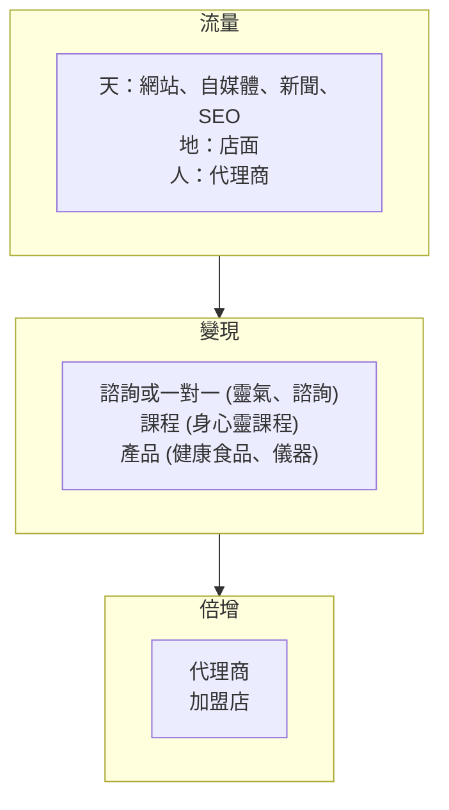
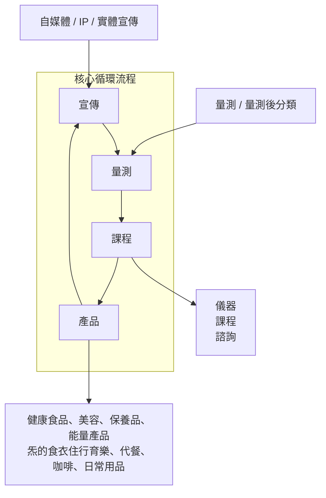
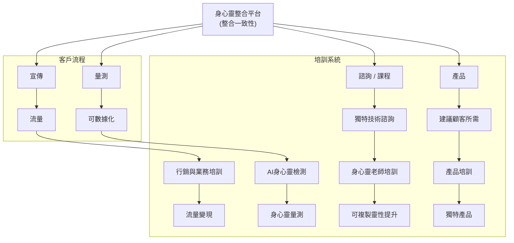
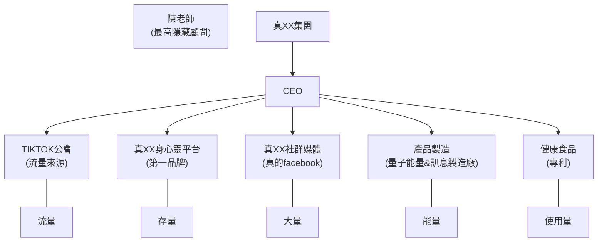
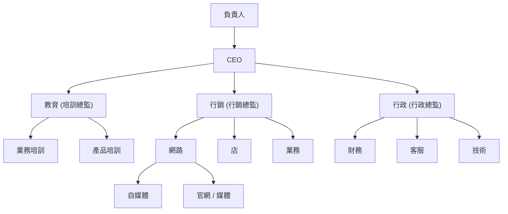

<!-- Slide 1 -->
# Slide 1

陳仲豪

經歷：
學習身心健康30年
身心靈健康產業21年
身心靈相關花超過400萬
台灣六萬名經銷商推薦第一名
拿過三家身心健康產業第一名
拿過20個以上銷售冠軍
經營過14家身心健康相關實體店，
學員超過10000人

<!-- Slide 2 -->
# Slide 2

18歲上心靈課程訂下人生目標

一、身心靈健康整合平台(亞健康)
二、身心靈療癒中心(重症)
三、身心靈學校&養生村(根本解)

<!-- Slide 3 -->
# Slide 3

平台創立動機

消費者:幫助更多人身心靈的健康 快樂
從業者:幫助從業者安身立命,進而幫助更多人 
核心:身心靈一站式的服務
包含診所 運動教室 諮詢室 整脊室

<!-- Slide 4 -->
# Slide 4

遇到大師指點 做出規劃

身心靈界的嚴選蝦皮，
身心靈界的全聯/SOGO
身心靈一站式的服務(諮詢 課程 產品)-定心 定靈
/發掘天賦
業力處理/ 前世回溯/ 身體處理/
靈性定位，處理靈的問題
真正幫助更多人身心靈的提升
靈魂導引/接引，連接主神，身心靈老師提升靈性

<!-- Slide 5 -->
# Slide 5

身心靈流程

<!-- Slide 6 -->
# Slide 6

半自動化循環流程

<!-- Slide 7 -->
# Slide 7

身心靈一站式服務培訓系統

<!-- Slide 8 -->
# Slide 8

代理商的收入來源

| 權利 | 利潤 | IFEEL 量測儀 |
| --- | --- | --- |
| 一．所有產品代理權 | 一．產品 | 一.單機版 20萬 |
| 二．所有課程與系統 | 二．課程 | 二.雲端版 2,8萬 |
|  | 三．諮詢 | 三.連鎖通路 |
| 三．經紀人的權限 | 四．直播主流量 | 四.國家政府 |
|  | 五．ＯＤＭ訂單 | 五.報告收入 |
|  | 六.廣告方案 | 六.結合產品 |
|  | 七.行銷方案 |  |

<!-- Slide 9 -->
# Slide 9

三年計畫

第一年,培訓,練兵練功,就像培養一個身心靈老師偶像團體一樣
第二年,培訓+產品, 賺錢 開說明會 

第三年,培訓+產品+大量開店

<!-- Slide 10 -->
# Slide 10

能量

<!-- Slide 11 -->
# Slide 11

企業架構

<!-- Slide 12 -->
# Slide 12

|  | 企業獨特優勢 |  |
| --- | --- | --- |
| 公司 | 身心健康優質品牌 | 創辦人的故事(不為利益) 實體點 |
| 產品 | 量子能量與其他結合 | 專利   特別產品 高利潤  日常用品取代 |
| 制度 | 解決所有直銷無法解決的問題 | 傳統制度  不會被傳直銷三個字影響 |
| 系統 | 免費引流 完整系統 趨勢 | 身心靈老師培訓 業務系統培訓 |
| 行銷模式 | 多通路布局  天地人 | 只要分享APP  後面收入就有關 |
| 品牌 | 培養很多身心靈老師推薦 | 最多身心靈老師推薦的品牌 |
| 團隊 |  | 專業團隊 |
| 技術 | 靈性技術 | 免費教 |

<!-- Slide 13 -->
# Slide 13

我們在徵的人才

1、身心靈老師或想學習的人(透過座談會)
2、特助(細心 )
3、財稅相關專業(會計師)
4、醫療相關專業(醫師/護理師/營養師/醫檢師/藥師 心理師)
5、行銷相關專業(小編/拍攝/剪片/經紀人)
6、法律相關專業

<!-- Slide 14 -->
# Slide 14

實體

一樓：咖啡廳+茶飲
二樓：運動教室 身心靈  
三樓：諮詢室/整脊/調理
四樓：診所
或者一層有兩個功能也可

<!-- Slide 15 -->
# Slide 15

咖啡廳外觀示意圖

<!-- Slide 16 -->
# Slide 16

運動教室示意圖

<!-- Slide 17 -->
# Slide 17

美容/身心靈教室外觀示意圖

<!-- Slide 18 -->
# Slide 18

辦公室示意圖

<!-- Slide 19 -->
# Slide 19

分租模式的行銷優勢

交叉引流
櫃台協助檢測 服務與成交
讓老師做本來在做的事情
吧檯飲品與點心可增加公司收益

<!-- Slide 20 -->
# Slide 20

| 層次 | 定位 | 時間 | 條件 | 收入模式 | 成長方向 |
| --- | --- | --- | --- | --- | --- |
| 1 | 靈性老師 / 個人顧問 | 2024、7 | 以自身能力開課或做個案 | 課程費、諮詢費 | 打造個人品牌、累積口碑 |
| 2 | 專業個體戶 | 2025、1 | 有穩定學員與回頭客，開始有小影響力 | 一對多課程、套裝服務 | 介紹個案 |
| 3 | 微型工作室 | 2025、9 | 大量尋找老師與業務團隊與工作人員 | 課程＋產品銷售 | 培養老師與業務 |
| 5 | 公司化經營 | 2026、5 | 租下辦公室或店面做初期培訓與內部測試 | B2C課程＋B2B合作（企業方案） | 建立培訓系統 |
| 6 | 小型品牌 | 2026、12 | 建立規模組織與大量曝光 一棟正式營業 | 會員制、訂閱制、品牌產品 | 打造真靈光店面營收樣板 |
| 7 | 連鎖 / 擴張中心 | 2027、10 | 擁有多個實體據點，可能採加盟模式 | 加盟金、授權費、分店營收 | 建立標準化課程＋加盟SOP(內部創業) |
| 8 | 全國品牌 | 2028 | 在全台灣多地區佈局，成為知名身心靈品牌 | 大型活動、出版、品牌合作 | 與政府、企業、學校合作 |
| 9 | 平台型企業 | 2029 | 建立「真靈光平台」，整合老師、學員、產品 | 平台抽成、廣告、流量變現 | 打造身心靈版的「蝦皮＋全聯」 |
| 10 | 生態系統企業 | 2030 | 建立完整「身心靈生態圈」： 課程、產品、療癒中心、學校、診所、金融 養生村 | 多元收入（平台＋實體＋科技＋投資） | 成為全球第一的身心靈生態系，連結百萬導師與用戶 |

#真靈光