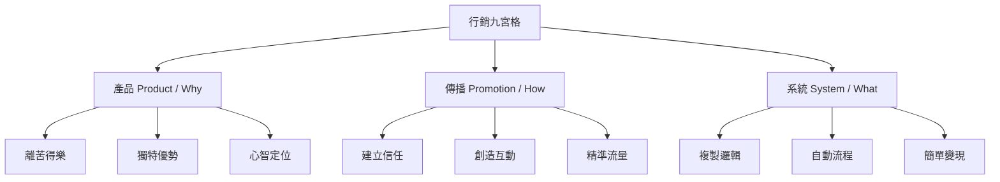

# 陳仲豪總監 - 說明會試講大綱

## 內容核心摘要
陳仲豪總監在本次說明會試講中，分享了他耗資數百萬行銷學習費用所濃縮出的「行銷九宮格」3x3 核心框架（涵蓋產品、傳播、系統，各分 Why、How、What 共 36 字訣），此框架專為身心健康與現場產業設計。陳總監主張行銷的本質是「愛與價值的分享」，並提倡大道至簡的「簡單變現」原則。會中除拆解核心框架外，亦透過火鍋店優化、線上課程零廣告費變現等實戰案例進行佐證，並宣傳即將推出的 30 小時實戰課程（學費 3,000 元，完課交作業全額退費），目標是幫助學員打下 60 分的行銷基本功。

---

## 重點大綱

### 一、 行銷的核心本質
*   **重新定義行銷**：相較於學術界饒舌的定義，陳總監將行銷本質簡化為「愛」。
*   **利他分享**：舉例家人腰閃到時，會極力推薦並帶他去熟識的專業醫生處就醫，這就是自發傳遞價值的口碑行銷。行銷就是讓顧客、客戶、合作夥伴與整個社會皆能從中受益的過程。

### 二、 行銷九宮格 3x3 核心框架
人腦容易記住的資訊量有限（腦科學中的 $7 \pm 2$ 原則，最容易接受的是 3 或 4），因此將複雜的行銷學濃縮為 3 個核心要素與「Why、How、What」的 36 字金句（記憶口訣：「壞好化腿」）。

#### 1. 產品 (Product) —— 創造價值 (Why)
*   **目的（離苦得樂）**：解決受眾痛點，帶領其離開痛苦、得到快樂。
*   **獨特優勢**：找出「你有我優，你有我變」的差異點。
*   **定位（角色/方案/顧客）**：明確「你是誰、賣什麼、解決誰的問題」。
    *   *黃金縫隙*：尋找「高需求、低競爭」的市場切入點（例如在行銷紅海中，切入「身心健康產業行銷」；在工具應用中引入高需求、低競爭的 AI 技術）。
    *   *價值尋找*：參考哈佛大學的 30 個價值表，用選擇代替創造。最有效的價值往往來自創作者自身「走過痛苦過程」的真實經歷。

#### 2. 傳播 (Promotion) —— 溝通價值 (How)
*   **建立信任**：信任三大來源：
    1.  自我信任（專業自證，展現自信與專業能力）。
    2.  他人肯定（客戶反饋、口碑推薦、故事見證）。
    3.  數據/權威認證（客觀數據、第三方機構或認證單位）。
*   **創造互動**：社群平台（如 Meta/FB）的底層邏輯是社交與互動，高互動能帶來演算法推薦（報文）。
*   **客從哪裡來（流量）**：專注經營高黏著度的自媒體。發揮定位內的有趣內容，避免做與定位無關的「泛流量」，否則無法建立個人 IP 與信任。

#### 3. 系統 (System) —— 交換與傳遞價值 (What)
*   **複製邏輯**：世上 99% 的商業與行銷模式皆已存在。新手應複製成功的選題（如「...的幾個步驟」）、文章框架與成功的商業模式。
    *   *經典原則*：只要持續有效就不要修改。先掌握人腦結構 2000 年來不變的底層邏輯，再學隨演算法變動的技巧，以避免行銷焦慮。
*   **自動流程**：利用 AI 工具簡化繁瑣流程，解決身心靈老師最頭痛的系統建置問題（課程中會安排專門的 AI 老師指導）。
*   **簡單變現**：大道至簡（如賈伯斯與老子哲學）。減少付費流程中的多餘步驟（例如在付款時拿掉強迫加入會員的步驟，可提升 30% 業績），避免給消費者過多選擇而導致卡關。

---

## 實戰案例分享

### 1. 林口火鍋店優化案（實體店面）
*   **背景與定位**：店家離長庚醫院有段距離，不適合主打時間緊湊的醫護客群。定位調整為鎖定家庭與媽媽客群，強調性價比。
*   **視覺與流程修改**：將 Logo 色系從沉重的黑色與紅色，改為夏天清爽的白色與藍色。將原本引導 Google 評論的機制，改為在 FB 留言互動。
*   **成效**：在零廣告費的情況下，創造了 2,000 多個留言、20 萬次觸及。單月來客數從 52 人增長至 192 人，營業額從 63 萬台幣提升至 252 萬台幣。

### 2. 個人線上課程變現案
*   **背景**：疫情爆發導致所有線下實體課程停辦。
*   **做法**：為了解決自身與學員的痛點，在沒有任何廣告預算下，撰寫了一篇針對「年後減肥與運動焦慮」的精簡文案，搭配年節暖色調（紅色）視覺與簡單易懂的動作示範，強調「簡單、無基礎也可上手」。
*   **成效**：一篇貼文創造 300 多個留言與高度互動，零廣告費變現達 100 多萬新台幣，諮詢預約排滿三個月消化不完。

---

## 課程設計與商業模式
*   **時數與費用**：共計 30 小時實戰課程，收費 **NTD 3,000** 元（約合 **USD 100** 元）。
*   **激勵機制**：學員只要完成功課即退還 **NTD 3,000** 元，消除學員對高額課程的疑慮。
*   **課程目標**：幫助學員從零基礎達到 60 分的行銷實踐水平，並贈送測量數據（如能力特質測量）。
*   **代理商模式**：未來將從完課學員中引導、篩選合適者成為代理商，共同拓展商業版圖。

---

## 關鍵行動清單 (Action Items) & 討論回饋

*   [ ] **豐富與調整案例庫**：聽眾的偏好與載體不同，應多準備不同載體（如暢銷書籍作者周慕姿、高瑞熙等）的知名案例，以增加學員連結。
*   [ ] **說明會案例呈現方式**：討論後建議將實戰案例「穿插在核心框架中」講述，效果比最後統一講述更好，但需嚴格控管時間，避免資訊過載。
*   [ ] **文化與價值置入**：將陳總監早晨冥想時獲得的靈感（「真、善、愛」）融入行銷九宮格的文案與課程文化中，吸引高契合度的受眾。
*   [ ] **下午 3:00 會議微調**：針對已完成的心智圖進行格式與編輯上的微調，並討論手機板視覺（如加上第一步、第二步、第三步的箭頭流程）。

#真靈光